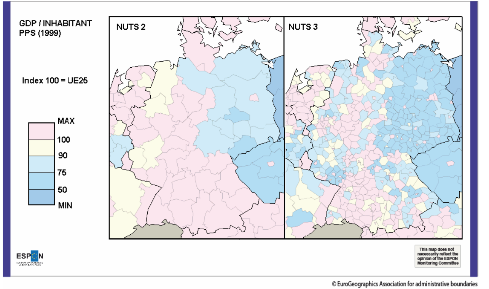

---
output:
  pdf_document: default
  html_document: default
editor_options: 
  markdown: 
    wrap: 72
---

# Introduction générale {#intro}

```{r setup, include=FALSE}
knitr::opts_chunk$set(echo = TRUE,fig.width =6,fig.align="center", fig.height = 3)
library(revealjs)
library(tidyverse)
library(palmerpenguins)
library(knitr)
library(xtable)
library(ggplot2)
library(gridExtra)
library(dplyr)
library(tufte)
library(sf)
quartiers <-  st_read("data/quartier_paris.shp")


knitr::opts_template$set(solution = list(box.title = "Solution",
                                         box.body = list(fill = "#e6f6e7", colour = "black"),
                                         box.header = list(fill = "#ace1af", colour = "black"),
                                         box.icon = "fa-check-square",
                                         box.collapse = TRUE))
knitr::opts_template$set(information = list(box.title = "Information",
                                            box.body = list(fill = "#bbe8f4", colour = "black"),
                                            box.header = list(fill = "#64c9e6", colour = "black"),
                                            box.icon = "fa-info-circle",
                                            box.collapse = NULL))


```

Commençons par le plus important :

::: attention
En présence de données, , avant tout calcul, la première chose à faire
est de les **visualiser**.
:::

<br>

Cette exploration visuelle permet:

-   d'identifier les intervalles de valeurs des variables, ou leur
    modalités
-   de se faire une idée de la répartition des valeurs des variables à
    l'intérieur de leurs intervalles
-   d'identifier des valeurs aberrantes
-   d'observer pour les variables spatialisées , leur répartition dans
    l'espace

en R, pour tracer directement tout un dataframe (=jeu de données) , on
utilise la commande `plot`

```{r plotplotplot, cache=TRUE}
library(palmerpenguins) #charge un jeu de données nommé 'penguins'
plot(penguins) #affiche une matrice de graphique 
```

Avec un peu d'expérience, on identifie rapidement des caractéristiques
utiles. par exemple ici :

-   les deux premières variables sont des variables qualitatives à trois
    modalités
-   les variables suivantes sont quantitatives, les deux dernières
    semblent corrélées positivement
-   les deux dernières variables sont qualitatives, à deux et trois
    modalités

**Ce cours a pour but de vous donner le vocabulaire et les outils
nécessaires à préciser le sens de ces caractéristiques, et d'en chiffrer
certaines propriétés.**

L'analyse statistique ne se confond pas avec l'analyse spatiale, bien
qu'elles soient parfois cousines. Nous allons commencer par préciser ce
qu'on entend par analyse spatiale et statistique, sachant que ce support
de cours se concentre sur les prémices de l'analyse statistique :
l'analyse **univariée** (cf section \@ref(univariee)) et l'analyse
**bivariée** (cf. section \@ref(bivariee))

## Analyse spatiale : définition

L'analyse spatiale étudie la **répartition** et l'**organisation**
d'objets **localisés**

L'objectif est de :

> *«déceler en quoi la localisation apporte un élément utile à la
> connaissances des objets étudiés et peut en expliquer les
> caractéristiques»*
> `r tufte::quote_footer('--- [Pumain, Saint-Julien 97]')`

## Analyse spatiale & Analyse Statistique

L'analyse statistique peut être vue comme l'utilisation de méthodes de
calcul pour *résumer* et *généraliser* des observations. Ces
observations constituent les **données**.

En analyse statistique :

-   On suppose *a priori* que les unités d'analyse sont des éléments
    indépendants, et on examine avec des outils statistiques, si les
    **variables** qui les décrivent sont elles-aussi indépendantes.\
-   On ne s'intéresse pas à la localisation de ces unités d'observation,
    ni à leur **interactions spatiales**.

En analyse **spatiale** statistique, au contraire :

-   Les unités d'analyse sont localisables, et donc ne sont pas toujours
    indépendants du point de vue spatial.
-   On s'intéresse à leur propriétés y compris et surtout leur
    localisation et l'effet de celle-ci : on fait l'hypothèse que la
    localisation des unités peut influencer les valeurs des variables
    des unités observées.

Prenons des exemples volontairement simplistes:

En statistiques «normales», on peut examiner le lien entre revenu
mensuel et la pointure d'une population: ce lien existe-t-il ? Si oui,
quelle est son intensité ?

En statistiques spatiales, on peut examiner la répartition des personnes
de pointure supérieur à 42 dans les zones littorales : cette répartition
a-t-elle une répartition particulière ou au contraire aléatoire ?
Quelles régularités peut-on observer dans cette répartition ? , etc.

## Deux approches en analyse spatiale

L'analyse spatiale peut désigner deux sortes d'analyse : l'analyse
géométrique et l'analyse de données spatiales.

L' **analyse géométrique** se concentre sur la géométrie (i.e. la forme)
des représentations numériques qui décrivent les objets du monde réel :

-   analyse de forme : aire , périmètre, compacité, etc.
-   analyse de réseaux : densité, centralité des nœuds, indice de
    Shimbel, (voir par exemple <https://groupefmr.hypotheses.org/3740>)
-   calculs de proximité (distance euclidienne, grands cercles, distance
    sur réseau, isochrones)

Par extension l'analyse géométrique concerne également la création
d'objets géométriques : buffers , intersections , unions, etc.

L'**analyse de données (spatiales)** , elle , s'attache à découvrir des
**relations** (des groupes, des lois, des régularités) dans des données
spatiales pour aider l'étude de certains phénomènes. En guise d'exemple,
on pourra se référer à ce qui est peut être la toute première analyse
spatiale par cartographie : l' [étude de la propagation du choléra par
John
Snow](https://fr.wikipedia.org/wiki/John_Snow#Propagation_du_chol%C3%A9ra)

```{r , echo=FALSE, cache=TRUE, fig.cap='Original map made by John Snow in 1854. Cholera cases are highlighted in black'}
johnsnow_url = 'https://upload.wikimedia.org/wikipedia/commons/thumb/2/27/Snow-cholera-map-1.jpg/512px-Snow-cholera-map-1.jpg'
if (!file.exists(johnsnow_file <- '512px-Snow-cholera-map-1.jpg'))
  download.file(johnsnow_url, johnsnow_file, mode = 'wb')
knitr::include_graphics(if (identical(knitr:::pandoc_to(), 'html')) johnsnow_url else johnsnow_file, )
```

Dans ce cours, nous n'aborderons ni l'une ni l'autre. Nous donnerons des
bases d'analyse statistique (donc *a-spatiale*), dont pourra dépendre
une partie de l'analyse de données spatiales

## Deux familles statistiques

On peut distinguer dans les statistique les statistiques
**inférentielles** et les statistiques **descriptives** .

### Statistiques inférentielles

Les statistiques inférentielles cherchent à caractériser une population
(=ensemble d'unités) à partir des caractéristiques d'un échantillon pour
lequel on a recueilli des **données** : par des mesures, des
observations, des enquêtes.

Les statistiques inférentielles cherchent à répondre de façon rigoureuse à la question suivante :

> « A partir d'un échantillon , que peut-on attendre (=**inférer**) de
> la population ? »

Cette famille de statistiques emploie des **modèles** et des
**estimateurs** pour réaliser des **régressions**, des **estimations**,
des **extrapolations**, voire des **prévisions**.

Ce sont les statistiques qui sont utilisées lors des sondages, des
recensements, mais aussi dans l'analyse de résultats expérimentaux (par
exemple pour décrire l'efficacité d'un médicament). La plupart du temps quand on emploie le
terme «statistiques» dans le langage courant, c'est de statistiques
inférentielles qu'il s'agit.

### Statistiques inférentielles : l'exemple des pingouins

```{r reglinexple, echo=FALSE, cache=TRUE, warning=FALSE, message=FALSE}
library(tidyverse)
ggplot(data = penguins, 
                       aes(x = flipper_length_mm,
                           y = body_mass_g)) +
  geom_point(aes(color = species, 
                 shape = species),
             size = 3,
             alpha = 0.8) +
  #theme_minimal() +
  scale_color_manual(values = c("darkorange","purple","cyan4")) +
  labs(title = "Penguin size, Palmer Station LTER",
       subtitle = "Flipper length and body mass for Adelie, Chinstrap and Gentoo Penguins",
       x = "Flipper length (mm)",
       y = "Body mass (g)",
       color = "Penguin species",
       shape = "Penguin species") +
    stat_smooth(method="lm", se=FALSE)+
  theme_minimal()
```

<small> Penguins data were collected and made available by Dr. Kristen
Gorman and the Palmer Station, Antarctica LTER, a member of the Long
Term Ecological Research Network.
[<https://github.com/allisonhorst/palmerpenguins>] </small>

Dans cet exemple, une régression linaire a été réalisée entre deux
variables : la masse du corps de pingouins et la longueur de leurs
nageoires. Pour autant que cette régression linaire soit de bonne
qualité (cf la section dédiée dans le chapitre \@ref(bivariee)), la
droite de régression, ici en bleu, est un modèle **linéaire** qui permet
, à partir de la valeur d'une des deux variables, de déduire la valeur
de l'autre, par une combinaison linéaire de type $Variabel1 = \alpha * Variable2 + \beta$, avec $\alpha$ et $\beta$, deux réels.

Par exemple, si on était en présence d'un pingouin avec une règle
graduée , mais sans balance, et qu'on mesurait sa nageoire à 197mm, on
peut se servir de la droite de régression pour postuler que ce pingouin
pèse autour de 4000g. C'est ce calcul qui est appelé parfois **prédiction** : le
modèle linéaire, s'il est bien ajusté au nuage de points , permet de
prédire la valeur de la masse du pingouin.

### Statistiques descriptives

Les statistiques descriptives ont pour but de décrire, résumer,
synthétiser les propriétés d'une **population**, potentiellement très
nombreuse, à partir des **variables** qui décrivent ses individus. Ce
résumé peut prendre plusieurs formes :

-   **Graphiques** : nuages de points , histogrammes, distributions,
    camemberts...
-   **Mesures agrégées** : moyenne , médiane, fréquences,
    caractéristiques des distributions, par exemple leur symétrie, leur
    aplatissement ... calculées à partir des valeurs des variables
-   **Liaisons statistiques** entre variables : corrélation, covariance,
    qui sont des mesures de l'intensité du lien qui peut exister entre
    deux variables
-   **Forme et structure** des données, particulièrement les
    regroupements, détectées par classification (k-means, Random Forest,
    DBSCAN), ou la réduction de la dimensionalité des données (Analyse
    en Composantes Principale),...

Voici des exemples de graphiques habituels :

```{r exple_nuage, echo=FALSE, cache=TRUE, warning=FALSE, message=FALSE}
ggplot(data = mpg, 
                       aes(x = cty ,
                           y = hwy)) +
  geom_point(aes(color=cyl),
             size = 3,
             alpha = 0.8) +
  labs(title = "Nuage de points ",
       subtitle = "Variable 2 en fonction de Variable 1, coloré par Variable 3",
       x = "Variable 1",
       y = "Variable 2",
       color = "Variable 3") +
  theme_minimal()
```

Le nuage de points est la représentation la plus courrante pour observer
deux variables d'une population.

```{r exple_hist, echo=FALSE, cache=TRUE, warning=FALSE, message=FALSE}
ggplot(data = mpg) +
  geom_histogram(aes(x=hwy), color="white", fill="darkcyan", bins=40) +
  labs(title = "Histogramme ",
       subtitle = "Nombre d'individu selon la valeur de leur Variable 1",
       x = "Variable 1",
       y = "Effectif"
       ) +
  theme_minimal()
```

L'histogramme est utilisé pour observer la répartition des valeurs d'une
variable. Il est recommandé de faire varier le nombre ou l'épaisseur des
barres qui le constituent pour ne pas «manquer» des phénomènes dans la
distribution de valeurs (par ex. plusieurs modalités fondues en une
seule du fait d'une résolution trop grossière)

```{r exple_dist2, echo=FALSE, cache=TRUE, warning=FALSE, message=FALSE}
dens <- density(mpg$hwy)
idxborne25 <- which(dens$x > 25  )[1]
idxborne30 <- which(dens$x > 30  )[1]
ggplot(data = mpg) +
  geom_density(aes(x=hwy), color="white", fill="darkcyan", alpha=0.7) +
  geom_vline(xintercept = 25)+
  geom_vline(xintercept = 30)+
  labs(title = "Distribution",
       subtitle = "",
       x = "Variable 1",
       y = "Densité"
       ) +
  theme_minimal()
```

la densité d'une distribution est un autre moyen de représenter la
répartition des valeurs d'une variable quantitative? Pour
l'interprétation d'un tel graphique, reportez-vous à la section dédiée \@ref(interpretdens) du chapitre \@ref(univariee)

```{r exple_pie, echo=FALSE, message=FALSE, warning=FALSE, cache=TRUE}

mydata <- data.frame(
  catégorie = c("catégorie A", "catégorie B", "catégorie C", "catégorie  D"),
  myvalue = c(42, 55, 93, 15)
)
plot1 <-  ggplot(mydata, aes(x="", y=myvalue, fill=catégorie)) +
  geom_bar(stat="identity", width=1, color="white") +
  coord_polar("y", start=0) +
  scale_fill_viridis_d()+ 
   labs(title = "Graphique circulaire, ou graphique en secteurs",
       subtitle = "Indique la répartition des valeurs d'une variable \n qualitative dans la population"
       )+
    theme_void() # remove background, grid, numeric labels+
plot1

```

Ce type de représentation est très populaire malgré des défauts certains
(voir par exemple ; <https://www.data-to-viz.com/caveat/pie.html>) , il
est à utiliser avec parcimonie!

Dans ce module, nous ferons majoritairement de la statistique
**descriptive**, notamment dans le chapitre d'Analyse Univariée
\@ref(univariee).

Dans le chapitre d'Analyse Bivariée \@ref(bivariee), nous verrons la
régression linéaire, qui, lorsque qu'elle est «utile» -- c'est à dire
que les deux variables présentent effectivement une dépendance
suffisamment linéaire pour être bien décrite par une droite-- peut être
considérée comme une technique de statistique **inférentielle** , et
utilisée pour «prédire» des valeurs, même si nous préférerons parler
d'*explication* plutôt que de *prédiction*.

### Les formats de données *wide* et *long*

Les données sont la plupart du temps **tabulaires**, (i.e. qu'on peut ranger dans un tableau de taille fixée) et peuvent apparaître
sous deux formats :

-   le format dit *long*, où chaque observation d'un même individu
    occupe une ligne\
-   le format dit *wide*, où chaque observation d'un même individu
    occupe une colonne

Exemple de données au format *wide*:

```{r expl_data_orga, echo=FALSE, cache=TRUE, warning=FALSE, message=FALSE}
data_wide <- read.table(header=TRUE, text='
 subject_ID sex mass measure_t1 measure_t2
       1   M     7.9  12.3  10.7
       2   F     6.3  10.6  11.1
       3   F     9.5  13.1  13.8
       4   M    11.5  13.4  12.9
')
data_wide
```

Exemple des mêmes données au format *long*

```{r expl_data_orga_long, echo=FALSE, cache=TRUE, warning=FALSE, message=FALSE}
data_wide <- read.table(header=TRUE, text='
 subject_ID sex pct measure_t1 measure_t2
       1   M     7.9  12.3  10.7
       2   F     6.3  10.6  11.1
       3   F     9.5  13.1  13.8
       4   M    11.5  13.4  12.9
')
data_wide %>%  gather(key = measure,value = value, pct:measure_t2)
```

## Vocabulaire {#vocabulaire}

-   Population : Ensemble d'**individus**. Le nombre d'individus d'une
    population est appelé l'**effectif**.

On parle aussi de "données", "corpus", "échantillon", "data", "dataset"
.

-   Individus : l'**individu** est l'unité statistique élémentaire. On
    parle parfois d'**observations**, en particuliers lorsqu'on mesure
    une évolution de quelque chose dans le temps.

Très souvent, les individus sont les **lignes** du tableau des données

-   Variables : les **variables** sont les caractéristiques d'un
    individu. On obtient les valeurs des variables par des mesures, des
    enquêtes, des observations...

Très souvent, les variables sont les **colonnes** du tableau des
données. On distingues deux types de variables : les variables
**quantitatives** et les variables **qualitatives**

### Variables quantitatives

Ce sont des variables qui représentent une **quantité**, une grandeur.
Ce sont des nombres , et ils sont parfois accompagnés d'une **unité**.
Par exemple : la taille, la masse, le revenu mensuel, la surface, les
points de vie,etc.

Les variables quantitatives peuvent être **continues** i.e. prendre des
valeurs réelles: $var \in \mathbb{R}$ , ou **discrètes** i.e. prendre
des valeurs entières : $var \in \mathbb{N}$ .

### Variables qualitatives

appelées aussi **facteurs** ou **variables catégorielles**.

Ce sont des variables dont les valeurs ne sont pas en général des
nombres, mais des catégories, qu'on appelle **modalités**. Par exemple :
la couleur des yeux , le genre, la catégorie socio-professionnelle, le
type de pokemon, etc.

Une variable qualitative ne peut prendre qu'un nombre fini de modalités,
qui sont définies par extension (i.e. on donne la liste des valeurs
possibles) Il peut arriver qu'une variable qualitative soit codée avec
des valeurs numériques, par exemple le niveau d'une alerte ou le code
postal d'un département.

#### variables qualitatives **nominales**

Les modalités ne sont **pas ordonnées** explicitement

e.g. situation matrimoniale $\in$ {marié·e, célibataire, veuf·ve}

#### variables qualitatives **ordinales**

Les modalités sont **ordonnées** selon un ordre **total** et non-ambigu.

e.g. Echelle de Likert (5 ou 7 valeurs, dont une neutre)

satisfaction $\in$ {Très satisfait, Satisfait, Ni satisfait ni
insatisfait, Peu satisfait, Pas du tout satisfait}

### Valeur et Nature des variables

Les données étant stockées sous la forme de caractères dans des fichiers
par exemple CSV, un même caractère ou suite de caractères pourra être
interprété de différentes façons à la lecture de ce fichier. <small>Ce
n'est pas le cas dans d'autres systèmes comme les bases de données, où
les colonnes sont typées à la création.</small>

Ainsi la **valeur** «trois» peut être exprimée dans des variables de
**nature** différentes. Cela peut-être :

-   la valeur numérique '3' , d'une variable quantitative, par exemple
    une hauteur en mètres.
-   la valeur caractère '3', d'une variable qualitative, par exemple
    l'arrondissement de paris où se trouve une adresse.

Un logiciel ne peut pas trancher seul entre ces deux alternatives, on
doit lui indiquer la nature des variables, en l'occurence pour un
logiciel de statistiques , indiquer si la variable est quantitative (de
type `numeric` ou `integer` en R) ou qualitative (de type `character` ou
`factor` en R).

Également, les valeurs manquantes d'un dataset sont parfois exprimées
avec les caractères `NA` (qui signifie "non attribué"), parfois avec
`NULL` , parfois avec rien.

Il revient à la personne qui traite les données d'identifier ces valeurs
manquantes et de les traiter de façon adéquate.

### Types de variables et représentations

La représentation des données doit être adaptées au type de variables.
La table suivante indique les choix de représentations conventionnels.

| Type                            | Échelle/Axes         |
|---------------------------------|----------------------|
| quantitative continue           | continue             |
| quantitative discrète           | discrète             |
| qualitative/modale non ordonnée | discrète             |
| qualitative/modale ordonnée     | discrète             |
| dates                           | continue ou discrète |
| texte                           | aucune ou discrète   |

<small> tiré de Fundamentals of Data Visualization Claus O. Wilke
[<https://serialmentor.com/dataviz/>] </small>

## Difficultés de la statistique

Nous donnons ci-dessous quelques exemples de difficultés inhérentes à
l'analyse statistique.

### Plusieurs discours sont possibles

Les statistiques sont délicates parce qu'un.e statisticien.ne ne peut
pas se limiter à des calculs et à la représentation graphique de ses
données, mais doit également les décrire **et** les interpréter.

Cette interprétation est elle-même difficile car des discours différents
peuvent être produits sur la base de chiffres identiques.

Considérons cet exemple, tiré du cours d'Ana-Maria Olteanu-Raimond :

Voici les chiffres du bilan d'une entreprise en 2013 et 2014

|      |       Ouvriers |         Cadres |
|:-----|---------------:|---------------:|
| 2013 | effectif : 500 | effectif : 100 |
|      | salaire : 1300 |  salaire :2200 |
| 2014 | effectif : 200 | effectif : 400 |
|      |  salaire :1170 | salaire : 1980 |

-   Mme. AAA : «tous les salaires ont baissé de 10%»
-   Mme. BBB : «le salaire moyen a augmenté d'environ 18%»

Ces deux phrases sont justes, et il n'y a pas lieu d'en choisir une plus
que l'autre. Un.e analyste consciencieux.se se devrait de mentionner les
deux à la fois .

### Taille et représentativité de l'échantillon

Les données ne sont jamais exhaustives: elles sont le résultats de
mesures, d'enquête et ne captent qu'une partie, un **échantillon** de
l'ensemble des objets qu'elles décrivent.

La taille et la représentativité de cet échantillon sont critiques, et
il est évident qu'on ne dit pas les mêmes choses à partir d'un petit
échantillon partial qu'à partir d'un vaste échantillon représentatif.

Quand on en a la possibilité, il faut toujours privilégier les données
les plus nombreuses et les plus représentatives du phénomène étudié.

#### Exemple de l'effet de la taille

Prenons un exemple avec des données "réelles" , on va calculer la
hauteur moyenne des arbres de paris , dont le jeu de données est
disponible
[ici](https://opendata.paris.fr/explore/dataset/les-arbres/information/?disjunctive.typeemplacement&disjunctive.arrondissement&disjunctive.libellefrancais&disjunctive.genre&disjunctive.espece&disjunctive.varieteoucultivar&disjunctive.stadedeveloppement&disjunctive.remarquable)

Après filtrage des données pour ne considérer que les arbres entre 1 et
40 mètres de hauteur, on va calculer la hauteur moyennes des arbres du
dataset:

```{r dataLoadingarbres, cache =TRUE, message=FALSE}
library(geojsonsf)
library(sf)
arbres <- geojson_sf("./data/les-arbres.geojson")
arbres <-  filter(arbres, hauteurenm < 40 & hauteurenm > 1 )
mean(arbres$hauteurenm)
```

On va maintenant opérer une selection sur les données et ne considérer
que les arbres étiquettés comme "jeunes" (variable
`statdedeveloppement`), et calculer leur hauteur moyenne :

```{r dataLoadingarbres2, cache =TRUE,message=FALSE}
arbresJeunes <-   arbres %>%  filter( stadedeveloppement =="J") 
mean(arbresJeunes$hauteurenm)
```

Évidemment , la hauteur moyenne des jeunes arbres n'est pas la même que
la hauteur moyenne des arbres en général!

Observons maintenant l'effet que peut avoir la taille de l'échantillon
sur un calcul de moyenne :

On va prendre des échantillons du dataset des arbres de Paris de plus en
plus petits (on divise par deux la taille de l'échantillons à chaque
fois) et on va observer la variation de la hauteur moyenne des arbres en
fonction de la taille de l'échantillon sur lequel on calcule.

Pour chaque taille d'échantillon, on réalise plusieurs tirages (50) et
on observe la dispersion des valeurs moyennes de la hauteur en mètres
sur 50 tirages , pour montrer la **variabilité de la valeur moyenne**

A titre indicatif, voici un moyen de coder simplement cette expérience
en R :

```{r effetTailleSample ,cache =TRUE,message=FALSE}

nb_samples <-  nrow(arbres)
samples <-  c()
while(nb_samples > 1){
  nb_samples <-  floor(nb_samples/2)
  samples <-  c(samples, nb_samples) # concaténation des listes
}

# fonction qui tire un échantillon d'une certaine taille dans une liste
myfunction<- function(taille,data){
  return(sample(data,taille,replace = F))
}
# tirage  simple
samples_hauteur <- sapply(samples, myfunction, arbres$hauteurenm)
valeurs_moyennes <-  sapply(samples_hauteur, mean)
names(valeurs_moyennes) <-  samples %>% as.character()

#on répète 50 fois le tirage
spls_sizes <- rep(samples, 50)
spl_h <- sapply(spls_sizes, myfunction, arbres$hauteurenm )
spl_moy  <-  sapply(spl_h, mean)

# constitution du dataframe
dfhmoy <-  data.frame(spl_moy, spls_sizes)
dfhmoy$spls_sizes <-  factor(dfhmoy$spls_sizes, levels=samples)
names(dfhmoy) <-  c("h_moy", "spl_size")
#graphique 
ggplot(dfhmoy ,aes(h_moy, spl_size))+
  geom_boxplot()+
  coord_flip()+
  theme(axis.text.x = element_text(angle = 90, vjust = 0.5, hjust=1))+
  labs(x="hauteur moyenne en mètre",
       y="taille de l'échantillon",
       title="Sensibilité de la moyenne à la taille de l'échantillon",
       subtitle = "On tire 50 échantillons de chaque taille.")
```

Ce graphique présente sous la forme d'un boxplot (ou boîte à
moustaches), la distribution de la valeur des moyennes des hauteurs,
calculées sur des échantillons dont la taille varie de 84508 individus,
soit la moitié du dataset des arbres filtrés, à 1 individu. Le boxplot
montre l'étendue de la variation d'une variable quantitative

Pour chaque taille d'échantillon, on réalise 50 tirages pour éviter les
"coups de chance", et on calcule la moyenne de chaque échantillon. On a
donc calculé 50 valeurs de moyenne , pour chaque taille d'échantillon.

Plus la boîte à moustache est grande (étirée), plus les valeurs de la
variable qu'elle représente sont variées. Le trait noir au milieu
représente la médiane des valeurs.

Sur notre graphique, on constate que la médiane des moyennes est très
stable et est toujours proche de 10, mais que les tailles des boxplots
sont très petites pour les échantillons de grande taille(indiquant que
la moyenne des hauteurs varie peu), et qu'au contraire , pour des
tailles d'échantillons faibles (moins de 100 individus), la moyenne des
hauteurs varie plus fortement.

Nous aborderons l'interprétation des boxplots dans le chapitre
\@ref(univariee) de façon plus précise.

Sur notre graphique, on constate que la médiane des moyenne est très
stable et est toujours proche de 10, mais que les tailles des boxplot
sont très petites pour les grandes tailles d'échantillons (indiquant que
la moyenne des hauteurs varie peu), et qu'au contraire , pour des
tailles d'échantillons faibles (moins de 100 individus), la moyenne des
hauteurs varie plus fortement.

Pour finir de se convaincre de ces variations, voici la représentation
alternative des valeurs moyennes en fonction de la taille des
échantillons sous la forme d'un nuage de point:

```{r effetTailleSample2 ,cache =TRUE,message=FALSE}
ggplot(dfhmoy ,aes(h_moy, spl_size))+
  geom_point(col="orange", size=0.5)+
  coord_flip()+
  theme(axis.text.x = element_text(angle = 90, vjust = 0.5, hjust=1))+
  labs(x="hauteur moyenne en mètre",
       y="taille de l'échantillon",
       title="Hauteur moyenne en fonction de la taille d'échantillon",
       subtitle = "On tire 50 échantillons de chaque taille.")
```

### Le paradoxe de Simpsons

Le paradoxe de Simpsons apparaît lorsqu'une population est structurée en
groupes et que deux hypothèses contradictoires peuvent être formulées,
suivant qu'on prenne en compte les appartenances des individus à ces
groupes ou non.

::: {style="text-align:center"}

:::

<small> source: wikipedia </small>

Par exemple, le nuage de points animé ci-dessus, illustre comment on
peut formuler deux hypothèses contradictoire concernant la même
population :

-   $H_A$ : la variable $x$ est corrélée linéairement et négativement
    avec la variable $y$
-   $H_B$ : la variable $x$ est corrélée linéairement positivement avec
    la variable $y$

$H_A$ est valable si l'on considère les valeurs de la population dans
son ensemble et **sans** tenir compte des groupes qui la structurent.

À l'intérieur de chaque groupe, $H_B$ est valable et contredit $H_A$.

### Échelle individuelle vs. Échelle agrégée

Lorsqu'on manipule des données spatiales, le territoire sur lequel les
données sont disponibles peut être découpé de plusieurs façons. Souvent,
ces découpages sont imbriqués : la maille d'un niveau $n$ est partionnée
en plusieurs mailles au niveau $n-1$. Par exemple, la France se découpe
en régions, elles-mêmes décomposées en départements, eux-mêmes
décomposés en commune.

Par exemple, la France se découpe en régions, elles-mêmes décomposées en
départements, eux-mêmes décomposés en commune.

Un jeu de données spatial est défini à un certain niveau de découpage
spatial. Par exemple, on peut disposer du revenu mensuel moyen des
foyers par commune, mais on ne dispose pas des données "brutes" qui y
ont conduit: les revenus des personnes qui composent les foyer des
communes.

La difficulté est qu'un jeu de données spatial est défini et disponible
à un certain niveau de découpage spatial, et que considérer ces mêmes
données à un niveau de découpage plus fin ou plus grossier nécessite une
transformation : l'**agrégation** ou la **désagrégation**.\
L'agrégation est relativement directe , la désagrégation l'est beaucoup
moins.

Par exemple, on peut disposer du revenu mensuel moyen des foyers par
commune, mais on ne dispose pas des données "brutes" qui y ont conduit:
les revenus des personnes qui composent les foyer des communes. Si on
désire considérer la même variable à un niveau de découpage plus
grossier (ici, les régions) ou plus fin (ici, les communes), on devra
agréger ou désagréger les données.

L'agrégation est relativement directe , la désagrégation l'est beaucoup
moins

### Agrégation

On parle d'agrégation lorsqu'on désirer regrouper des données
disponibles à un niveau de découpage donné Inférer des caractéristiques
concernant les unités agrégées d'après les caractéristiques
individuelles

En fonction des données manipulées, l'agrégation peut se faire par la
somme (par exemple pour des stocks) la moyenne (par exemple pour des
ratios), ou tout autre combinaison bien choisie.

### Désagrégation ou Ventilation

On parle de désagrégation ou de ventilation de données lorsqu'à partir
de données disponibles à un niveau de découpage donné, on cherche à
simuler une répartition de données à un niveau de découpage **plus
fin**, tout en restant cohérent avec la répartition des données au
niveau de découpage originel.

Solution triviale donc sans intérêt:

Pour une variable de **stock** $V_s$ (on dit aussi variable d'effectif)
, i.e. mesurant une quantité d'objets, et en l'absence de toute autre
données ou contraintes, on peut affecter aux $n$ communes du département
un nombre constant valant $\frac{V_s}{n}$.

Pour une variable de **ratio** $V_r$, on peut affecter le même ratio
$V_r$ à toutes les mailles qui composent la maille à désagréger.

Si on écarte la solution triviale, la désagrégation de données est une
opération complexe, pour lesquels il existe cependant plusieurs méthodes
de *génération de population synthétique* respectant certaines
contraintes, comme l'[Iterative Proportional
Fitting](https://en.wikipedia.org/wiki/Iterative_proportional_fitting)

Les choses se compliquent encore si les découpages ne sont pas imbriqués
les uns dans les autres. Généralement, on agrège les valeurs par des
sommes pondérées par la surface des entités spatiales concernées. Un bon
aperçu des méthodes d'allocation spatiale est donné dans [ce
document](https://www.tse-fr.eu/sites/default/files/medias/doc/wp/etrie/wp_tse_446.pdf)

## À quelle échelle observer ? le MAUP

Puisqu'une même zone peut être découpée de différentes façons, avec des
mailles de taille variable, susceptibles d'évoluer dans le temps (par
exemple les limites adminsitratives des communes en France), toute
question d'analyse spatiale (et donc d'analyse spatiale statistique)
comporte une question spécifique à l'échelle d'observation : **À quelle
échelle observer nos données ?**

Cette question peut se décomposer en deux sous-questions, liées :

-   quel maillage utiliser ? Par exemple: une maille régulière carrée ou
    hexagonale, les contours adminsitratifs, les mailles
    [IRIS](https://www.insee.fr/fr/metadonnees/definition/c1523) ?\
-   quelle taille de maille choisir ?

Il est très difficile de répondre à ces questions dans l'absolu, c'est
même un problème «insoluble» appelé le **MAUP** (Modifiable Areal Unit
Problem).

Les raisons de cette impossibilité de déterminer le découpage idéal pour
observer une donnée spatialisée sont nombreuses. En voici quelques unes,
qui je pense sont les principales:

-   La plupart des phénomènes d'intérêts sont multi-scalaires,
    c'est-à-dire qu'ils peuvent se produire et/ou s'observer à plusieurs
    niveaux d'échelle.
-   L'agrégation peut faire disparaitre certains détails, certaines
    spécificités dans la cartographie des données.
-   Des effets de la géométrie du découpage (appelés effets de zonage)
    modifie la représentation cartographique des données

Voici quelques exemples qui montrent ces difficultés.

### Effet de zonage

Cette image tirée de la page wikipedia
[gerrymanding](https://fr.wikipedia.org/wiki/Gerrymandering), illustre
bien comment un découpage d'une même zone peut amener à des résultats de
vote différents.

```{r img_gerryManding, echo=FALSE, cache=TRUE, fig.cap='Différentes manières de découper des circonscriptions électorales.'}
gerrymanding_url = 'https://upload.wikimedia.org/wikipedia/commons/d/d3/DifferingApportionment.svg'
if (!file.exists(gerrymanding_file <- '512px-gerrymanding.svg'))
  download.file(gerrymanding_url, gerrymanding_file, mode = 'wb')
knitr::include_graphics(if (identical(knitr:::pandoc_to(), 'html')) gerrymanding_url else gerrymanding_file, )
```

### MAUP : exemples

Ces exemples sont tirés du rapport ESPON :

<https://www.espon.eu/sites/default/files/attachments/espon343_maup_final_version2_nov_2006.pdf>

::: {style="text-align:center"}

:::

Vous pouvez noter comme les zones du Sud en découpage NUTS 2 , sont
représentées uniformément rose (valeur max du GDP/hab) alors qu'avec un
découpage plus fin (NUTS 3), la situation du sud est loin d'être aussi
uniforme : on note par exemple que la moitié Est des mailles du Sud-Est
a des teintes plus mélangées dans le découpage NUTS3, avec un mélanges
de mailles jaunes et bleues, que dans le découpage NUTS2 .

De même, les zones frontalières du Luxembourg et de la Belgique
apparaissent plus pauvres (teintes jaunes et bleues) dans le découpage
NUTS 3 que dans le découpage NUTS2.

De manière générale : l'agrégation va "lisser" les aspérités des
données, certains contrastes ne «survivent pas» à l'agrégation spatiale.

::: {style="text-align:center"}

:::

Dans ce deuxième exemple, on voit la forme et la taille des mailles
changer.

Là aussi, un effet de lissage, indissociable de l'agrégation, fait
apparaitre certaines régions comme uniformes et cachent certains
singularités: par exemple le fait que les zones les plus lointaines du
littoral sont pauvres (teintes oranges à l'arrière du pays, Nord et
Nord-Ouest) dans le découpage en mailles carrées de 30km n'apparait pas
dans le découpage administratif(les deux vignettes de gauche), tout en
longueur.

## Rappel: La première "chose à faire"

**Représenter/Tracer/Cartographier** les variables de la population.

Cette exploration visuelle permet:

-   d'identifier les intervalles de valeurs des variables, ou leur
    modalités
-   de se faire une idée de la répartition des valeurs des variables à
    l'intérieur de leurs intervalles
-   d'identifier des valeurs aberrantes
-   d'observer pour les variables spatialisées , leur répartition dans
    l'espace

D'autre part, comme le montre l'exemple ci-dessous, les valeurs de
statistiques peuvent être trompeuses, et discriminent beaucoup moins
bien des situations qualitativement très différentes que notre œil :

::: {style="text-align:center"}

:::

Les valeurs chiffrées affichées sont la **moyenne**, l'**écart-type** et
la **corrélation** des deux séries qui forment le nuage de points. Le
chapitre suivant introduira ces notions.
