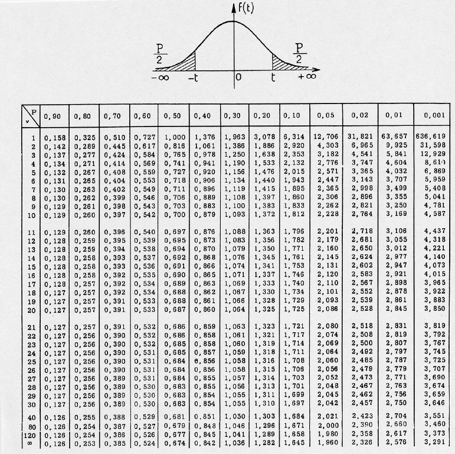

# Analyse Bivariée {#bivariee}


```{r setup, include=FALSE}
knitr::opts_chunk$set(echo = TRUE,fig.width =6,fig.align="center", fig.height = 3)
library(knitr)
library(xtable)
```

# Introduction & Rappels  

## Sources et Reférences

- Ce cours reprend le cheminement du cours M2 IGAST 2017 d'Élodie Buard 
- R et espace https://framabook.org/r-et-espace/
- Probabilités, analyse de données et statistiques , Gilbert Saporta, Editions TECHNIP, 2011
- Nombreuses ressources en ligne : 
   http://www.foad-mooc.auf.org/IMG/pdf/424B_-Application_des_methodes_statistiques_d_analyse.pdf
- et wikipedia !

## Rappel  : Deux familles statistiques

### Statistiques **inférentielles**

<br>
  Pour répondre à la question : «A partir d'un échantillon , que peut-on attendre (inférer) de la population ?»
<br>

  - Modèles, estimateurs, ... : **régression**, **estimation**, **extrapolation**
  - *Liaisons* statistiques : **corrélation**, **covariance**
  - test statistiques, notions de probabilités
  - e.g. sondages, rencensement, intervalle de confiance , prédictions, ...

##  Rappel : Deux familles statistiques
  
### Statistiques **descriptives** 

<br>
  Pour **résumer**, **synthétiser**, rendre intelligible, les propriétés d'une **population** à partir des **variables** qui décrivent les individus et la **répartition** de leurs valeurs.
<br> 
  
  - Graphiques (histogrammes, boxplots, )
  - Mesures (fréquences , distributions , moments)
  - classification, ACP,...

##   Rappel : Vocabulaire 
 
<br>
**Population** :  Ensemble d'individus  
 
 "données", "corpus", "échantillon", "data"
<br>
 
**Individu** :  Unité statistique **élémentaire** = «les lignes du tableau»

**Variables ** :  Caractéristiques, propriétés d’un individu, **mesurées** par des enquêtes, des observations,... = «les colonnes du tableau»  


## L'objet du cours : l' Analyse Bivariée

Objectif : **Analyser**  le **lien** entre deux variables, par exemple : 


**lien entre deux variables quantitatives**

<font size=4>
"nombre d'habitants et nombre de lignes de bus  par département"

"nombre de lignes de bus en 1998 et en 2018"  
</font>

**lien entre deux variables qualitatives** 

<font size=4>
"couleur des yeux  et port de lunettes" 
</font>

**lien entre une variable quantitative, une variable qualitative** 

<font size=4>
"taille et couleur des yeux"  
</font>


## Mise en garde

 <span style="color:red"> Une liaison, même très forte, entre deux variables, n'indique pas la causalité! &#9888;</span>

Erreur très courrante, très tentante.


© TylerVigen http://tylervigen.com/spurious-correlations


## Analyse bivariée avec des données spatiales

### Données spatiales
  
- Individus restreints spatialement (selection spatiale)
- variables "géographique " (e.g. lieu de résidence) renseignées pour les individus 
  
prise en compte des **distances** ? $\rightarrow$ modèle gravitaire 

### Données localisées

- Auto-corrélation spatiale (Moran's I)
- Geographicaly Weightd Regression (GWR) $\approx$ regression linéaire avec prise en compte de la distance entre individus


# Régression linéaire 


## Première étape   

<span style="color:red">Toujours en premier:</span> Regarder l'aspect des données avec des graphiques ("exploration visuelle") 

```{r plotIris, fig.width=8}
data(iris)
plot(iris)
```

Existe-t-il un lien entre des variables ?


## Diverses formes des dépendances 

```{r formes, echo=FALSE, fig.width= 8, fig.height=5}
x <- runif(100, min = 0, max=10)
y1 <- 8.5*x - 23 + rnorm(100,0, 12)
y2 <- -16*x +12 + rnorm(100,0,10)
y3 <- sqrt(exp(x)) + rnorm(100,0,8)
y4 <-  50*sin(x) + rnorm(100,0,10)
y5 <-  rnorm(100, 0, 60)
y6 <- 21.345
data2 <-  data.frame(x, y1, y2, y3, y4, y5, y6)
library(reshape2)
library(ggplot2)
data2 <- melt(data2, idvars=c("x"), measure.vars=c("y1","y2","y3","y4", "y5", "y6"))
plo2 <-  ggplot(data2, aes(x=x, y=value))+
  geom_point(size =1, color = "#0FAF96", alpha=0.8)+
  facet_wrap(~variable)+
  xlab("value of x variable")+
  ylab("value of yi variable")
  
plo2
```

En pratique les formes sont beaucoup moins régulières.


## Les étapes
1. Tracer le nuage de points
2. Existe-t-il une relation ? 
3. Est-elle de forme linéaire ?  De quel sens ?
4. Si la liaison est de forme linéaire $\rightarrow$ faire une **régression** 
5. Si la liaison est non linéaire, est-elle monotone ?  De forme connue ?$\rightarrow$  Proposer un **modèle**


5bis. Réaliser un modèle **LOESS** avec prudence (uniquement descriptif , aucun pouvoir de généralisation) 

cf le blog de Lise Vaudor [http://perso.ens-lyon.fr/lise.vaudor/regression-loess/]

## Régression linéaire 
 
Si la forme du nuage de points s'y prête, on peut faire une **régression linéaire** (aussi appelé  **ajustement** linéaire).
 
On cherche la droite qui «passe au mieux» (=*ajustée*) dans le nuage de points de deux variables quantitatives $V_1$ et $V_2$,  qui permet de vsiualiser: 

* l'**intensité** du lien / de la dépendance  : points proche de la droite ou non ?
* la **forme** de la dépendance : linéaire ou non ?
* le **sens** de la dépendance  : nulle, positive ou négative ?

## Régression linéaire 

```{r regline, echo=FALSE, fig.width=6, fig.height=4, message=F}
library(ggplot2)
data <-  data.frame(X=c(1,2,3,5,6,7,12,14,22, 2,3 ,10,10,9,7),Y=c(15,16,13, 9,9,12,3,2,5,11,12,7,8,9,8))
plo <-  ggplot(data, aes(x=X, y=Y))+
  geom_point()+
  geom_smooth(method="lm", se=FALSE)+
  xlab("Var1")+
  ylab("Var2")
plo
```

 
 
«Droite qui passe au mieux»  = qui minimise la **somme des écarts quadratiques** entre la droite et les points du nuage.


 
## Régression linéaire : le modèle
 

L'**équation** de la droite  est un **modèle linéaire** de la relation statistique qui lie $V_1$ et $V_2$; 

Ici le modèle est :  $\hat{V_2}=aV_1+b$


 
\

Si la régression linéaire est avérée, alors pour un individu $i$ dont on connait $V1_i$, on infère la valeur $V2_i$ par le modèle :    $\hat{V_{2i}} = aV_{1i} +b$
 
 On dit aussi que $V_1$ **explique** $V_2$ , ou que le modèle **prédit** $V_2$ à partir de $V_1$ (on note les valeurs prédites $\hat{V_2}$)
 
## La grande question 

  Comment déterminer qu'une régression linéaire est «correcte» ? 
  
  
## Comment evaluer la "validité" du modèle linaire ?

En pratique, il faut réunir deux critères : 

- des coefficients avec des **p-values** associées **faibles** (e.g. <0.05)  $\leftrightarrow$ "on a peu de chances de se tromper"
- un $R^2$ élevé  $\leftrightarrow$ "le modèle prédit bien les observations"
  
 
## le $R^2$
 
 $R^2 \in [0;1]$ , c'est le  **coefficient de détermination linéaire**.

Donne la **qualité de prédiction** de la régression. 

"Proche de 1"" $\equiv$ "très bonne qualité"
 
C'est le pourcentage de "variation" de $V_2$ due à la "variation" de $V_1$

## le $R^2$

défini par : 
 $R^2  = 1 - \frac{\sum_{i=1}^{n} (y_i - \hat{y})^2}{\sum_{i=1}^{n} (y_i - \bar{y})^2}$


si on note $\hat{V_2}$ les valeurs de $V_2$ prédite par le modèle linéaire, alors:

 $R^2=cor(\hat{V_2},V_2)^2$   

(au sens de la corrélation de Pearson)


## la p-value

Elle peut s'interpréter comme «la probabilité d'avoir un résultat de regression identique avec deux variables véritablement indépendantes» 

<br>
<br>

La p-value est associée à la notion d'**hypothèses nulle**. 
Ici , l'hypothèse nulle est "les deux séries sont indépendantes". 


## la p-value 
 
Plus grossièrement : la p-value est le  **pourcentage de chances de se tromper** en rejetant l'hypothèse nulle, 

<br> c'est à dire <br>

se tromper en considérant que  les deux séries ne sont pas indépendantes et qu'il existe une relation entre les deux (ici, linéaire car nous testons un modèle linéaire).


## l'Hypothèse nulle 

$H_0$ : «les deux variables sont indépendantes»


  - **conserver** $H_0$ : considérer les deux variables comme **indépendantes**
  - **rejeter** $H_0$ : considérer les deux variables comme **dépendantes** = ayant une relation statistique, un lien.


## Format des resultats donnés par avec R

```{r reslm,fig.width=6, fig.height=4}
regression <- lm(iris$Petal.Length~iris$Petal.Width)
summary(regression)
```

Distribution des résidus, coefficients du modèle ajusté et leur **p-value** associée (ici sur un test de Student, notée `Pr(>|t|)` et  $R^2$) 


## Bonus: Critères de significativité du lien linéaire 

Les **résidus** $\epsilon_i$ (écart entre valeur observée et valeur prédite ($V_2 - \hat{V_2}$) par le modèle pour l'individu $i$) doivent:

- être indépendants  : covariance nulle ou très faible $cov(x_i, \epsilon_i) = 0$
- être distribués selon un loi normale de moyenne nulle $\epsilon \sim \mathscr{N}(0,\sigma_{\epsilon})$
- être distribués de façon homogène (homoscédasticité), i.e. de variance constante $var(\epsilon_i)=\sigma_{\epsilon}^2$ , indépendante de l'observation


## Bonus: Evaluation de l'indépendance des résidus avec R 

Graphique de la fonction `acf`:  

Si une barre exceptée la première dépasse  la ligne en pointillés, on peut remettre en cause l'indépendance des résidus. Ici, c'est le cas.

```{r residualSigni3,fig.width=6, fig.height=4}
modele1 <- lm(iris$Petal.Length~ iris$Petal.Width)
acf(residuals(modele1))
```


 


## Bonus:Les 4 graphiques résultats de la fonction `lm`


La fonction `lm` de R et ses résultats permettent de tracer 4 graphiques pour évaluer certains des critères de significativité.


```{r residualSignif,fig.width=6, fig.height=4, cache=T}
modele1 <- lm(iris$Petal.Length~ iris$Petal.Width)
par(mfrow=c(2,2)) # pour avoir une matrice de graphes
plot(modele1)
```


## Bonus: Évaluer l'homogénéité des résidus avec R

Premier graphique : pour vérifier que le nuage de points est homogène (e.g. pas de relation non-linéaire entre résidus et valeurs prédites)

Une éventuelle relation non-linéaire pourrait se retrouver dans les résidus(Ici : légère structure parabolique )

```{r residualSignif1,fig.width=6, fig.height=3, cache=T}
modele1 <- lm(iris$Petal.Length~ iris$Petal.Width)
plot(modele1,1)
```


## Bonus: Evaluer la normalité de la distribution des résidus avec R

Le deuxième graphique "Q-Q plot" : pour vérifier l'**hypothèse de normalité des résidus**, les points doivent être proches de la bissectrice  


```{r residualSignif2,fig.width=6, fig.height=4, cache=T}
modele1 <- lm(iris$Petal.Length~ iris$Petal.Width)
plot(modele1,2)
```


## Bonus: Evaluer l'homoscédasticité des résidus 

<span style="font-size:18px;"> Le troisème graphique "Scale location" : si les résidus sont distribués de façon homogène suivant les valeurs "fittées",  alors la droite est plutôt horizontale et les points sont disposés de façon homogène autour.</span>

```{r residualSignif3,fig.width=6, fig.height=2.5, cache=T}
modele1 <- lm(iris$Petal.Length~ iris$Petal.Width)
plot(modele1,3)
```

<span style="font-size:18px;">Ici: légère pente mais les points sont distribués de façon relativement homogène autour de la droite.</span>


# Corrélation de deux variables quantitatives 

## Corrélation (linéaire)

Dans le cas d'une liaison statistique linéaire entre deux variables, on peut calculer l'«intensité» de ce lien sans nécessairement trouver les coefficients modèle linéaire : c'est la  **corrélation**

$cor(x,y) \in [-1;1]$ entre deux variables $x$ et $y$ .

- +1 : les deux variables croissent ou décroissent conjointement
- -1 : quand l'une des variables croît, l'autre décroît.
- 0 : pas de relation **linéaire** entre les deux variables
 
 <font size="3">R donne le coefficient de Pearson par defaut, l'argument `method` de la fonction `cor()` permet de spécifier deux autres coefficients : Kendall et Spearman.</font>


## Test de corrélation entre deux variables avec R

Version plus complète : c'est un **test**, on a plusieurs indicateurs statistiques sur ce test, notamment la **p-value** et **l'intervalle de confiance**

```{r cortestIris}
cor.test(iris$Petal.Length, iris$Petal.Width)
```
Rappel : la p-value quantifie la **significativité** du test.
En général, on considère le test significatif si elle est en dessous de 5%, soit 0.05.  


## Calcul direct du coefficient de corrélation

Soient deux variables $V_1$ et $V_2$

Le coefficient de corrélation $r$ de $V_1$ et $V_2$ est la normalisation de la covariance par le produit des écart-types des variables 

$r= \frac{cov(V_1,V_2)}{\sigma_{V_1}\sigma_{V_2}}$ 


La covariance est la **moyenne du produit des écarts à la moyenne**

$cov(V_1,V_2)= E[(V_1-E[V_1])(V_2-E[V_2])]$


## Matrice de corrélations


```{r corMatIris}
cor(iris[,1:4])
```

Présentation des corrélations entre les variables quantitatives d'un tableau, pour tous les couples de variables.

La matrice de corrélation est symétrique, et sa diagonale est constituée de 1.


## Sensibilité aux 'outliers'

```{r sensitiveOut1}
X <-  c(3,2,3,4,1,2,3,4,5,2,3,4,3)
Y <-  c(1,2,2,2,3,3,3,3,3,4,4,4,5)
plot(X, Y, xlim = c(0,16), ylim= c(0,16))
cor.test(X,Y)$estimate
```


## Sensibilité aux 'outliers'

```{r sensitiveOut2}
X <-  c(3,2,3,4,1,2,3,4,5,2,3,4,3,15)
Y <-  c(1,2,2,2,3,3,3,3,3,4,4,4,5,15)
plot(X, Y, xlim = c(0,16), ylim= c(0,16))
cor.test(X,Y)$estimate
```

## Sensibilité aux 'outliers'

Outlier : observation "*anormale*",  par sa valeur extrème , comparée aux autres.


La corrélation et la régression linéaire sont très sensibles aux outliers.

$\rightarrow$ s'interroger sur la nécessité de nettoyer/filter les données et des conséquences 


# Régression linéaire avec R

## Regression linéaire avec R

Fonction  `lm()` , modèle de la forme `Variable_a_expliquer ~ Variable_explicative` 

```{r regress, echo=TRUE }
my_model <- lm(Petal.Width~Petal.Length, data=iris)
summary(my_model)
```


## Que faire lorsque la relation n'est pas linéaire ?

Quand les deux variables sembles corrélées , de façon **monotone** mais **non linéaire**,

$\rightarrow$ Coefficient de **Spearman**, basé sur le **rang** des individus.

<center>
$\rho = 1 - \frac{6\sum_{i=1}^{n}(rg(X_i)-rg(Y_i))^2 }{n^3 -n}$
</center>


avec :

$rg(X_i)$ le *rang* de $X_i$  (le classement de sa valeur) dans la distribution de $X$

$n$ le nombre d'individus

## Obtenir le coefficient  de Spearman avec R


```{r rho}
cor.test(iris$Sepal.Length, iris$Sepal.Width, method="spearman", exact = FALSE)
```


l'argument `exact` doit être précisé en cas de valeurs ex aequo dans les données.  


## Utilisation conjointe des coefficients de Pearson et Spearman 

$r$ (Pearson) et $\rho$ (Spearman) sont deux moyens d'estimer la corrélation: lequel choisir ?

si $r = \rho$: on garde $r$ (plus simple à interpréter)

si $r < \rho$: la relation est non-linéaire : prendre  $\rho$

si $r > \rho$: il y a un biais, prendre $\rho$ (plus robuste)

... et toujours **tracer le nuage de points** pour examiner  la nature de la relation.


# "trucs" pour linéariser des relations non-linéaires


## Relation log-linéaire 

```{r loglin, echo=FALSE, fig.width= 8, fig.height=4, cache=T}
x <- runif(1000, min = 0, max=10)
y1 <- 1.5*x^2.2  + rnorm(1000,10, 12)
data2 <-  data.frame(x, y1)
library(ggplot2)
plo2 <-  ggplot(data2, aes(x=x, y=y1))+
  geom_point(size =1, color = "#0FAF96", alpha=0.8)+
  xlab(" x ")+
  ylab(" y ")
plo2
```


Relation de type $y=ax^b$ 

se linéarise par $ln(y)=aln(x) + ln(b)$


## Relation géométrique (exponentielle) 

```{r expolin, echo=FALSE, fig.width= 8, fig.height=4, cache=T}
x <- runif(1000, min = 0, max=10)
y1 <- exp(1.5*x+ 0.2)  + 10000*rnorm(1000,10, 12)
data2 <-  data.frame(x, y1)
library(ggplot2)
plo2 <-  ggplot(data2, aes(x=x, y=y1))+
  geom_point(size =1, color = "#0FAF96", alpha=0.8)+
  xlab(" x ")+
  ylab(" y ")
plo2
```


Relation de type $y=e^{ax+b}$ 

se linéarise par $ln(y)=ax + ln(b)$

## Relation logarithmique

```{r logar, echo=FALSE, fig.width= 8, fig.height=4, cache=T}
x <- runif(1000, min = 0, max=10)
y1 <- 1.5*log(x)+ 0.2  + 0.22*rnorm(1000,1, 2)
data2 <-  data.frame(x, y1)
library(ggplot2)
plo2 <-  ggplot(data2, aes(x=x, y=y1))+
  geom_point(size =1, color = "#0FAF96", alpha=0.8)+
  xlab(" x ")+
  ylab(" y ")
plo2
```

Relation de type $y=a*ln(x)+b$ 

$\rightarrow$ changement de variable 

## Relation logistique

```{r logistic, echo=FALSE, fig.width= 8, fig.height=4, cache=T}
x <- runif(1000, min = 0, max=10)
ymax <-  10
ymin <- 0
y1 <- ymin+ ((ymax -ymin) /(1 + exp(-1.5*x+6.8))) + 0.5*rnorm(1000,1,1)
data2 <-  data.frame(x, y1)
library(ggplot2)
plo2 <-  ggplot(data2, aes(x=x, y=y1))+
  geom_point(size =1, color = "#0FAF96", alpha=0.8)+
  xlab(" x ")+
  ylab(" y ")
plo2
```

Relation de type $y= y_{min} * \frac{y_{max}-y_{min}}{1+e^{ax+b}}$

se linéarise par $ln\bigg(\frac{y_{max}-y}{y-y_{min}}\bigg)=ax+b$

# Lien entre deux variables qualitatives

## Représentation graphique

Pour deux variables qualitatives, on ne peut pas produire de nuages de points, ni de droite de régression.

$\rightarrow$ on peut représenter la table de contingence (cf. fonction `mosaicplot` de R).

```{r mosaic, echo=FALSE, fig.height=3}
library(RColorBrewer)
mypalette <-  brewer.pal(12,"Set3")
par(mar=c(0,0,0,0))
mosaicplot(~Class+Survived, data=Titanic, color=mypalette,main = "")
``` 


## Test statistique dit du "Chi 2" ou "Chi carré"

Le test du $\chi ^2$ est un test d'indépendance, il mesure l'**écart**, la différence,  entre deux distributions de **variables qualitatives**  

Il répond à la question : "Existe-t-il un lien statistique entre deux séries de valeurs qualitatives"  

(La réponse est de type  OUI/NON , le $\chi^2$ ne donne pas l'**intensité** du lien)


## Test statistique dit du "Chi 2" ou "Chi carré"

- Hypothèse nulle $H_0$ : les deux distributions sont indépendantes.
- «faire le test» permet de conserver ou de rejeter cette hypothèse

## Principe du Chi 2

- On génère une **population théorique** à laquelle on va comparer la **population observée** en considérant leurs **distribution**.
- Cette distribution théorique reflête ce qui se passerait si on suppose que $H_0$ est vraie 
- Avec cette comparaison,  on pourra rejeter ou conserver l'hypothèse nulle.

La construction de cette distribution se fait à partir du **tableau de contingence**


##  Tableau de contingence

C'est un tableau à double entrée qui croise deux **variables qualitatives**. 


Dans une case on trouve l'**effectif** (= le nombre) des individus caractérisés par la conjonction des modalités en ligne et en colonnes.


Exemple sur des formes géométriques de couleurs :

$$\begin{array}{c|c|c}
   & blanc & noir \\ 
   \hline
carré &  22 &   12 \\ 
  \hline
  rond &   10 &  30 \\ 
    \hline
  triangle &  26 &   5 \\ 
\end{array}$$


Dans R : fonction `table()`

## Construction de la distribution théorique.

On commence par sommer les effectifs selon les modalités (en ligne et en colonne)

$$\begin{array}{c|c|c|c}
   & blanc & noir & \texttt{total}\\ 
   \hline
carré &  22 &   12 & 34\\ 
  \hline
  rond &   10 &  30 &  40  \\ 
    \hline
  triangle &  26 &   5 &  31\\
  \hline
  \texttt{total} & 58 & 47 & 105
  \end{array}$$

On appelle les sommes en lignes et en colonnes **sommes marginales**, elles sont mises dans les "marges" du tableau.


## Construction de la distribution théorique

En divisant par la taille de la population, on obtient les **fréquences observées**.

$$\begin{array}{c|c|c|c}
   & blanc & noir & \texttt{total}\\ 
   \hline
carré &  0.20952381&  0.11428571 &  0.3238095\\ 
  \hline
  rond &    0.09523810 & 0.28571429 & 0.3809524  \\ 
    \hline
  triangle & 0.24761905 & 0.04761905 &   0.2952381\\
  \hline
  \texttt{total} &  0.552381 & 0.447619 & 1
  \end{array}$$

<font size="4">
On obtient les **pourcentages de l'effectif** dans les cases du tableau.


C'est également la **probabilité** , qu'un individu de la **population observée** soit caractérisé par les modalités en ligne et en colonne.
</font>

## Construction de la distribution théorique

$$\begin{array}{c|c|c|c}
   & blanc & noir & \texttt{total}\\ 
   \hline
carré &  0.20952381&  0.11428571 &  \textbf{0.3238095}\\ 
  \hline
  rond &    0.09523810 & 0.28571429 & \textbf{0.3809524}  \\ 
    \hline
  triangle & 0.24761905 & 0.04761905 &   \textbf{0.2952381}\\
  \hline
  \texttt{total} &  \textbf{0.552381} & \textbf{0.447619} & 1
  \end{array}$$


De la même façon, les **fréquences marginales** (marges divisées par la taille de la pop.), donnent la **probabilité** d'observer un individu de la modalité correspondant à la ligne ou à la colonne considérée.

<font size="4">
Exemple : dans cette population , j'ai 29.5% de chances de tirer un triangle, et 55% de chances de tirer une pièce blanche.
</font>

## Construction de la distribution théorique

Rappel : Probabilité conjointe de deux évènements $A$ et $B$ **indépendants**  
$P(A \cap B) = P(A) \times P(B)$

À partir des **fréquences marginales** précédentes, on obtient pour chaque couple de modalités, la probabilité **théorique**,  celle qui suppose $H_0$, par un simple **produit**.

<font size="4">
Exemple :  Si $H_0$ est vraie, la probabilité d'observer un triangle noir est donnée par: 

$P(triangle \cap noir) = P(triangle) \times P(noir)$

$P(triangle \cap noir) =0.447619 \times 0.2952381  = 0.1321542$

La probabilité théorique d'observer un triangle noir est de 13,2%  
</font>

## Construction de la distribution théorique

On crée un second tableau, dont chaque case vaut le produit des fréquences marginales calculées sur le tableau des observations.

$$\begin{array}{c|c|c|c}
   & blanc & noir & \texttt{total}\\ 
   \hline
carré &  0.1788662 &   0.1449433 &  \textbf{0.3238095}\\ 
  \hline
  rond &    0.2104309 &0.1705215 & \textbf{0.3809524}  \\ 
    \hline
  triangle &  0.1630839 & 0.1321542 &   \textbf{0.2952381}\\
  \hline
  \texttt{total} &  \textbf{0.552381} & \textbf{0.447619} & 1
  \end{array}$$

C'est le tableau des **fréquences théoriques**.


## Tableau des effectifs théoriques

On l'obtient en multipliant les fréquences théoriques par la taille de la population observée (ici 105)


$$\begin{array}{c|c|c}
   & blanc & noir \\ 
   \hline
carré &  18.78095 &  15.21905 \\ 
  \hline
  rond &   22.09524 & 17.90476    \\ 
    \hline
  triangle & 17.12381 & 13.87619   \\
  \end{array}$$

<font size="4">
N.B. Il n'est pas nécessaire d'arrondir les effectifs théoriques
</font>


## Calcul du Chi 2


C'est la somme, pour chaque case du tableau de contingence (i.e. pour chaque couple de modalités),  des écarts carrés entre effectif observé et effectif théorique**, divisés par l'effectif théorique.

Soient $T^{obs}$ le tableau des effectifs observés, $T^{theo}$ le tableau des effectifs théoriques, 


<center>
$\chi^2 =  \sum_{i,j}  \frac{( T^{obs}_{i,j} -  T^{theo}_{i,j})^2}{T^{obs}_{i,j}}$       
</center>

ici : $\chi^2 = 26.30329$


## Interprétation du Chi 2 

Il faut comparé la valeur du $\chi^2$ calculée avec la **valeur critique** qu'on trouve   dans une **table de loi de Student** (ou table de loi du chi 2).

C'est un tableau à double entrée : une **valeur de quantile**, et un **degré de liberté**.

On peut considérer que la valeur de quantile est le pourcentage d'erreur qu'on s'autorise de faire.  On prend souvent **5%** :  la colonne 1-0.05 =  0.95

Le degré de liberté est obtenu en calculant la valeur $(nb\_lignes - 1)*(nb\_colonnes -1)$.

Dans notre exemple , le degré de liberté est 2*1 = 2


## Table de loi de Student 

<center>
</img>
</center>


## Interprétation du Chi 2 


D'après le tableau de la loi de Student , la valeur critique pour un test avec 5% de chances de se tromper est un degré de liberté de 2 vaut 4.303.

Si la valeur calculée du $\chi^2$ est **supérieure** à la valeur critique, on **rejette** $H_0$.


Pour notre exemple: On rejette $H_0$, i.e. les deux variables sont **dépendantes**,  car $\chi ^2 \approx 26 > 4.303$

Interprétation: «la forme est liée à la couleur dans cette population, nous pouvons l'affirmer avec un risque d'erreur d'au moins  5%»


## Les étapes du $\chi ^2$

- Tableau de contingence
- Sommes marginales 
    - Calcul des fréquences observées 
    - Calcul des fréquences théoriques
- Tableau d'effectifs théoriques
- Calcul de la valeur du test 
- Comparaison avec les valeurs de la table de Student 


# Lien entre une variable qualitative et une variable quantitative.


## Représentation graphique.

Pas de moyen **simple** de calculer le lien entre une variable qualitative et une variable quantitative.
  
  - corrélation de rang 
  - régression logistique 
  - analyse de la variance (ANOVA)
  
$\implies$ Alors on fait un graphique ! 

La variable qualitative sert de **catégorie**, on fait varier la représentation graphique de la variable quantitative suivant cette catégorie.

2 possibilités :

  - boîtes à moustaches
  - superposition d' histogrammes / densités 

## Les boîtes à moustaches 

"Boîte à moustaches", aussi appellées "boxplot", montre les quartiles d'une variable

Quartile = «quantile de 4», valeurs qui séparent une variable quantitative en quarts, i.e. paquets d'un quart de l'effectif

- Premier quartile : sépare les 25% inférieurs des valeurs
- Second quartile : **mediane**, sépare les 50% inférieurs des valeurs
- troisième quartile : sépare les 75% inférieurs des valeurs


Dans R, fonction `quantile` 

## Boxplot et Distribution


```{r, echo=FALSE, cache=TRUE, warning=FALSE, fig.width=8, fig.height=6}
library(ggplot2)
library(cowplot)


n <-  4000
xval <-  rbeta(n, shape1 = 2, shape2 = 5) * 1000
mydf <-  data.frame(x=xval)
xmean <-  mean(xval)
xsd <-  sd(xval)

xlabels <- data.frame(
  x = c(quantile(mydf$x)),
  y = c(rep(330,5) ),
  text = paste0(c("","Q1: ", "Q2: ", "Q3: ", ""),names(quantile(mydf$x)))
)
distriPlot <-  ggplot(mydf, aes(x=x))+
  geom_histogram(bins = 50, fill="#0FAF96", color="grey")+
  geom_vline(data = xlabels, xintercept = xlabels$x, linetype=c(2,2,1,2,2))+
  geom_label(data= xlabels, aes(x=x,y=y,label=text) )+
  xlab("X")+
  ylab("Effectif")

# Marginal density plot of x (top panel) and y (right panel)
yplot <- ggplot(mydf, aes(y = xval))+
  geom_boxplot(outlier.alpha = 0.2)+
  coord_flip()+
  xlab("")+
  ylab("")+
  theme_void()

#assemblage
plot_grid(yplot, distriPlot,  ncol = 1, align = "hv",scale = c(1,1), 
          rel_widths = c(1, 1), rel_heights = c(1, 3))
```


## Boxplot par catégories


Principe : on trace un boxplot par modalité de la variable qualitative.

E.g. : consommation de véhicules par type (dataset `mpg` de R)


```{r, echo=FALSE, warning=FALSE}
p <- ggplot(mpg, aes(class, hwy))
p + geom_boxplot(outlier.alpha = 0.2) +xlab("type de véhicule (var. qualitative)") +ylab("consommation (var. quantitative")+theme_light()
```


# Références supplémentaires


## Refs


Cours complet sur les modèles linéaires : [https://www.math.univ-toulouse.fr/~barthe/M1modlin/poly.pdf]


Interprétation des graphique de `lm` en R : [https://data.library.virginia.edu/diagnostic-plots/]


