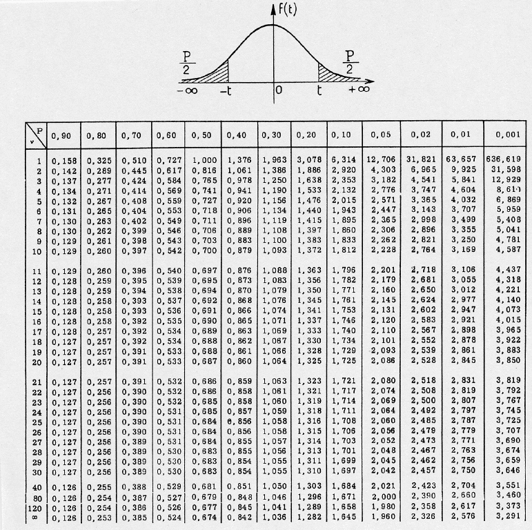

# Analyse Bivariée {#bivariee}


## Introduction

L'analyse bivariée , comme son nom l'indique, a pour objectif d'analyser le lien qui peut exister entre **deux** variables.


En guise de rappel sur les types de variables (cf section \@ref(vocabulaire)) , donnons des exemples: 

Pour deux variables quantitatives , on pourrait analyser le lien entre : 

- le nombre d'habitants et nombre de lignes de bus des départements français
- le nombre de lignes de bus en Isère en 1998 et en 2018  


Pour deux variables qualitatives, on pourrait analyser le lien entre : 

- la couleur des yeux  et le fait de porter des lunettes
- les catégories de séries télé et la plate-forme  où ils sont disponibles 


Enfin, pour une variable quantitative et une variable qualitative :

- le lien entre la taille et la couleur des yeux, 
- le lien entre  le nombre d'aces d'un joueur et le côté du cours de tennis qu'il occupe


### Analyse bivariée, mais sans la localisation


  
L'analyse bivariée que nous allons aborder dans ce chapitre concerne des variables traditionnelles, i.e. **pas des variables de localisation** . Si elles proviennent de données spatiales, ce sera : 

- soit des individus restreints spatialement (sélection spatiale)
- soit des variables "géographiques" (e.g. lieu de résidence) renseignées pour les individus

La **localisation en tant que variable** n'interviendra **pas** dans ce cours.
  

### Ressources pour l'analyse des localisation et des distances 

Il existe des outils statistiques pour analyser le lien qui existe entre des variables localisées dans l'espace *et leur localisation elle-même*. Ces techniques **ne sont pas au programme de ce cours**, je les mentionne pour les curieux. 


On peut ainsi mesurer l' **auto-corrélation spatiale** , qui indique si les valeurs proches sont regroupées ou au contraire disséminées dans l'espace, à l'aide de l'[indice de Moran  global](https://en.wikipedia.org/wiki/Moran%27s_I), et identifier des clusters de valeurs plus fortes ou plus faibles que la normale à l'aide de l'[indice de Moran local](https://geodacenter.github.io/workbook/6a_local_auto/lab6a.html).


On peut également effectuer des  régressions qui tiennent  compte de la localisation des observations dans l'espace, qu'on appelle GWR pour **Geographicaly Weighted Regression** (plus de détails [sur wikipedia](https://fr.wikipedia.org/wiki/R%C3%A9gression_g%C3%A9ographiquement_pond%C3%A9r%C3%A9e) et la [fiche de l'INSEE](https://www.google.com/url?sa=t&rct=j&q=&esrc=s&source=web&cd=&ved=2ahUKEwjxtrK85pvuAhX2DmMBHdDaCTwQFjAAegQIAxAC&url=https%3A%2F%2Fwww.insee.fr%2Fen%2Fstatistiques%2Ffichier%2F3635545%2Fimet131-m-chapitre-9.pdf&usg=AOvVaw0Mli34vfm-BI1PymvssD5Y)) 


Enfin , si on désire prendre en compte les **distances** dans les flux entre unités spatiales (par exemple pour expliquer les déplacements domicile-travail dans une région) on peut se tourner vers les [modèles gravitaires](https://www.hypergeo.eu/spip.php?article76) 

Nous donnerons à la fin de ce cours quelques éléments à ce sujet dans la section \@ref(anaspat) 


### Corrélation n'implique pas causalité 


Nous allons voir comment quantifier l'intensité du **lien statistique** qui peut exister entre deux variables.

<center>
 <span style="color:red; font-size:1.5em"> &#9888; Une liaison, même très forte, entre deux variables, n'indique pas la causalité! &#9888;</span>
</center>


<br>
Cette erreur d'amalgame entre corrélation et causalité est très courante, très tentante, justement à cause du fait que l'amalgame «marche» dans de nombreux cas empiriques. 


De nombreux contre-exemples sont heureusement disponibles pour finir de se convaincre que la **corrélation n'implique pas la causalité**: 


© TylerVigen http://tylervigen.com/spurious-correlations $\leftarrow$ D'autres exemples sont disponibles à cette adresse.


### Diverses formes de dépendances 


Ce qu'on appelle **lien** ou **liaison** ou encore **dépendance** entre les variables expriment le fait que les valeurs de deux variables n'évoluent pas indépendamment mais au contraire présentent une certaine **forme** une certaine **régularité**.

Ces «régularités» peuvent être de plusieurs formes, en voici quelques unes : 


```{r formes, echo=FALSE, fig.width= 8, fig.height=5}
x <- runif(100, min = 0, max=10)
y1 <- 8.5*x - 23 + rnorm(100,0, 12)
y2 <- -16*x +12 + rnorm(100,0,10)
y3 <- sqrt(exp(x)) + rnorm(100,0,8)
y4 <-  50*sin(x) + rnorm(100,0,10)
y5 <-  rnorm(100, 0, 60)
y6 <- 21.345
data2 <-  data.frame(x, y1, y2, y3, y4, y5, y6)
library(reshape2)
library(ggplot2)
data2 <- melt(data2, idvars=c("x"), measure.vars=c("y1","y2","y3","y4", "y5", "y6"))
plo2 <-  ggplot(data2, aes(x=x, y=value))+
  geom_point(size =1, color = "#0FAF96", alpha=0.8)+
  facet_wrap(~variable)+
  xlab("value of x variable")+
  ylab("value of yi variable")
  
plo2
```

Cette matrice de graphes, de gauche à droite et de haut en bas montre :

- une dépendance linéaire positive
- une dépendance linéaire négative
- une dépendance non-linéaire , peut-être exponentielle
- une dépendance périodique, sinusoïdale
- une absence de dépendance, les deux variables sont indépendantes
- une absence de dépendance, la variable de l'axe des $y$ est constante


En pratique les formes sont beaucoup moins régulières que ces exemples très «mathématiques» : les données peuvent être bruitées, incomplètes, contenir des outliers, etc.


### Les étapes de l'analyse bivariée 

On peut résumer la démarche 'mentale' à adopter devant un jeu de données par cette séquence:

1. Tracer le nuage de points
2. Existe-t-il une relation ? 
3. Est-elle de forme linéaire ?  De quel sens ?
4. Si la liaison est de forme linéaire $\rightarrow$ faire une **régression** 
5. Si la liaison est non linéaire, est-elle monotone ?  De forme connue ?$\rightarrow$  proposer un **modèle**, i.e. une équation qui décrive la forme de la dépendance entre les deux variables.
6. (5bis)Réaliser un modèle **LOESS** avec prudence (uniquement descriptif , aucun pouvoir de généralisation) 
cf le blog de Lise Vaudor [http://perso.ens-lyon.fr/lise.vaudor/regression-loess/]


Voici un arbre de décision plus précis : 


## Contenu du chapitre 


**Lien entre deux variables quantitatives**   

La section \@ref(reglin) traite de la régression linéaire, la section \@ref(correlation) traite de la corrélation, la section \@ref(manipR) montre comment réaliser ces opérations avec R 
la section \@ref(lineariser)  montrer quelques astuces pour linéariser des dépendances de formes connues

**Lien entre deux variables qualitatives**   

la section \@ref(chi2) traite de test du $\chi^2$

**Lien entre une variable qualitative et une variable quantitative**

la section \@ref(qualiquanti) montre quelques représentations graphique faisant intervenir une variable qualitative et une variable quantitative.


## Régression linéaire {#reglin} 


### Avant toute chose  


Vous devriez commencer à avoir l'habitude de ce mantra, encore plus valable dans le cas d'une analyse bivariée : 

<span style="color:red; font-size: 1.5em;">Toujours en premier: Regarder l'aspect des données avec des graphiques </span> 


Si le nuage de point n'est pas allongé, si vous "voyez" clairement qu'une droite ne le résulera pas, ou alors très mal, il n'est pas nécessaire d'entreprendre une rregression linéaire, qui sera de toute façon décevante!  


La regression linéaire ne concerne que les **variables quantitatives**.


### Principe et Vocabulaire
 
#### Droite de régression

Si la forme du nuage de points s'y prête, c'est-à-dire bien allongée, rectiligne, on peut entreprendre une **régression linéaire** (aussi appelé  **ajustement** linéaire).
 
Cela consiste à trouver la droite qui passe «**au mieux**» dans le nuage de points de deux variables quantitatives $V_1$ et $V_2$, celle qui **résume** le nuage de points d'une façon satisfaisante.


«**au mieux**» est ici employé au sens des **moindres carrés**, c'est-à-dire que parmi toutes les droites qui peuvent passer au milieu du nuage de points, on va choisir celle pour laquelle l'erreur commise est la plus faible. 


On cherche la droite (en fait on cherche les deux coefficients $a$ et $b$ de son équation $y=ax+b$) qui minimise la somme des carrés des écarts, d'où le nom d'estimation MCO (Moindres Carrés Ordinaires) ou OLS (Ordinary Least Squares in english).


Si le nuage de points n'est pas amorphe, sans forme, et que les deux variables ne sont pas totalement indépendantes, ou constantes, alors cette droite est **unique**.  


#### Modèle linéaire


En réalisant une régression linéaire, on cherche à **expliquer** une variable à partir d'une autre. «Expliquer» signifie ici «avoir un **modèle** pour calculer une valeur de la variable à partir d'une autre». 


Dans le cas d'une régression linéaire, le modèle est l'équation de **la** droite ajustée, de la forme $y=ax +b$, celle qui minimise la somme des écarts au carré.


On cherche donc les valeurs de $a$ et de $b$ (les coefficients du modèles linéaire) qui nous permettrait de calculer la valeur d'une variable (la variable dite **expliquée**) à partir d'une autre (la variable dite **explicative** ), que l'on peut écrire naïvement de cette façon : 

$$Valeurs\ de\ la\ variable\ expliquée = modèle(Valeurs\ de\ la\ variable\ explicative)$$

$$Valeurs\ prédites\ de\ V_2 = modèle(V_1)$$

Ici, notre modèle est linaire, donc:


$$Valeurs\ prédites\ de\ V_2 = a\times V_1 + b$$


 **Variable explicative**:
 C'est celle qui est utilisée par le modèle pour calculer les valeurs de la variable expliquée. Dans notre exemple , c'est $V_1$. Par convention , on la met sur l'axe des $x$ dans les graphes.


 **Variable expliquée** : 
 C'est la variable pour laquelle le modèle propose des valeurs: dans notre exemple c'est $V_2$. Par convention on la met sur l'axe des $y$ dans les graphes.


#### Estimation, Prédiction, Résidu


On peut utiliser le modèle, pour **estimer** (=calculer, prédire) les valeurs de $V_2$, avec les valeurs de $V_1$ et à l'aide de l'équation de droite. On  note souvent les valeurs prédites $\hat{V_2}$.

L'écart entre $\hat{V_2}$ et $V_2$ est appelé **résidu**. 

Ainsi pour toutes les observations du jeu de données, on a :  


$$V_2 =  prediction(V_1) + residu$$ 
$$V_2 =  \hat{V_2} + residu$$ 


#### L'erreur commise par le modèle

L'erreur commise par la droite, c'est la somme des écarts entre les points du nuage et la droite, les **résidus**, ces écarts sont élevés au carré avant d'être sommés pour que les erreurs positives et négatives ne se compensent pas. On appelle parfois cette somme la SSE (Sum of Square Erros in english) ou la RSS (Residuals Sum of Squares in english).

On peut l'écrire avec des notations différentes, mais la signification est toujours la même :

$$SSE = \sum_i (prediction_i - observation_i)^2$$
$$SSE = \sum_i ( modele(x_i)- x_i)^2$$
$$SSE = \sum_i ( ax_i + b - x_i)^2$$
$$SSE = \sum_i ( \hat{y_i}- x_i)^2$$


> On peut noter qu'il ne s'agit pas de la distance entre les points et la droite (leur projeté orthogonal), mais bien l'écart en ordonnée qui intervient dans ce calcul.


Quasiment toutes les statistiques inférentielles reposent sur ce genre d'équation : on cherche un modèle d'une variable, à partir d'autres variables explicatives, et parmi les modèles possibles, on essaye de réduire l'erreur et de trouver le «bon» modèle: celui qui produise des résidus avec de nombreuses propriétés souhaitables : valeurs faibles,  identiquement distribuées, de distributions proches de la gaussienne, sans auto-corrélation temporelle ni spatiale, etc. 

Nous reviendrons dans la section bonus \@ref{residuslm} sur la façon de qualifier les erreurs commises par un modèle linaire avec R.


### Interpréter la droite de régression

L'objectif de la régression linéaire est trouver le meilleur modèle linéaire entre deux variables. Ce modèle est l'équation d'une droite, qu'on appelle **droite de régression** et qui permet de visualiser: 

* l'**intensité** de la dépendance, suivant que les points sont proches de la droite ou non
* la **forme** de la dépendance, suivant que le nuage soit bien de forme linéaire
* le **sens** de la dépendance : nulle, positive ou négative 


```{r regline, echo=FALSE, fig.width=6, fig.height=4, message=F}
library(ggplot2)
data <-  data.frame(X=c(1,2,3,5,6,7,12,14,22, 2,3 ,10,10,9,7),Y=c(15,16,13, 9,9,12,3,2,5,11,12,7,8,9,8))
plo <-  ggplot(data, aes(x=X, y=Y))+
  geom_point()+
  geom_smooth(method="lm", se=FALSE)+
  xlab("Var1")+
  ylab("Var2")
plo
```

 
Dans cet exemple, le nuage de point est assez allongé, on constate une dépendance linaire négative. Les points sont relativement proches de la droite.

 
### Utiliser un modèle linéaire 
 

L'**équation** de la droite  est un **modèle linéaire** de la relation statistique qui lie $V_1$ et $V_2$; 

Ici le modèle est :  $\hat{V_2}=aV_1+b$

Si la régression linéaire est réussie, alors pour un individu $i$ dont on connait $V1_i$, on infère la valeur $V_{2i}$ par le modèle :    $\hat{V_{2i}} = aV_{1i} +b$
 
On dit aussi que $V_1$ **explique** $V_2$ , ou que le modèle **prédit** $V_2$ à partir de $V_1$ (on note les valeurs prédites $\hat{V_2}$).


Il est intéressant d'avoir un (bon) modèle de la relation entre $V_2$ et $V_1$, car en l'absence d'observations supplémentaires de $V_2$ , on peut estimer les valeurs qu'elles prendraient si on dispose d'observations supplémentaires de $V_1$.

Imaginez que des observations de $V_2$ soient particulièrement coûteuses à recueillir, et les observations de $V_1$ particulièrement peu coûteuses,  par exemple la production de salive d'un tigre adulte en colère ($V_2$) et la largeur de ses empreintes ($V_1$).
En cas de bonne qualité de régressions, le.la zoologiste sera ravi.e de mesurer les largeurs d'empreintes.


 
### Évaluer la  qualité d'une régression linaire : le $R^2$


En pratique, pour considérer qu'une régression linéaire est de bonne qualité, i.e. que le modèle linéaire qui lie les deux variables décrit (explique, prédit, ..) bien les données,   il faut réunir deux critères : 

- des coefficients avec des **p-values** associées **faibles** (e.g. <0.05)  qu'on peut grossièrement traduire par "on a peu de chances de se tromper"
- un **$R^2$ élevé**,   qu'on peut traduire par  "le modèle prédit bien les observations"
  

D'autres critères sont donnés en bonus à la section \@ref(residuslm).

On commence par le $R^2$.

 
#### le $R^2$
 
Le **coefficient de détermination linéaire** ,  noté $R^2$  est une valeur qui décrit la **qualité de prédiction** de la régression,  c'est-à-dire à quel point la droite de régression estime correctement les valeurs de la variable expliquée.


Il est défini par : 
 $$R^2  = 1 - \frac{\sum_{i=1}^{n} (y_i - \hat{y})^2}{\sum_{i=1}^{n} (y_i - \bar{y})^2}$$


- $R^2 \in [0;1]$
- Plus le $R^2$ est proche de 1, meilleure est la qualité.

Pour avoir l'intuition de l'interprétation de cette formule, on peut remarquer que la fraction est un ratio entre la somme des résidus au carrés (écart entre valeurs observées $y_i$ et valeur prédite $\hat{y_i}$) et la variance (cf. section \@ref(variance)) de la variable expliquée ($y$).  

Le dénominateur de la fraction est constant , il vaut $var(y)$
Alors, intuitivement , pour un mauvais modèle, qui prédit mal les observations de $y$, la somme des résidus au carré sera importante, donc la fraction également, et la valeur de $R^2$  sera petite, proche de 0.
De la même manière, pour un bon modèle, qui prédit bien les valeurs de $y$, les résidus seront faibles, donc leur somme quadratique également, ainsi que la valeur de la fraction, ce qui donnera un $R^2$ proche de 1.

Mentalement , on peut réécrire la formule ainsi : 

$$R^2 \approx 1- \frac{résidus^2}{variance\ de\ y}$$

$$R^2 \approx 1- (erreur\ commise\ normalisée)$$


####  Propriétés et interprétation additionnelles du $R^2$


Le $R^2$ peut s'écrire de plusieurs façons, notamment ainsi : 

$$R^2  =  \frac{\sum_{i=1}^{n} (\hat{y_i} -\bar{y} )^2}{\sum_{i=1}^{n} (y_i - \bar{y})^2}$$


Cette expression est intéressante pour nous car on reconnait encore une fois une fraction de *variances* (cf. section \@ref(variance)) : 

- au dénominateur , c'est la variance de $y$ , la variable expliquée
- au numérateur , c'est la variance de $\hat{y}$, la variable prédite par le modèle 

(les termes en $\frac{1}{n}$  des variances au numérateur et dénominateur se simplifient )

On peut donc voir le $R^2$ comme un ratio de variances : celles des estimations et celles des observations.
En faisant une regression, on cherche à «capturer» la variance de la variable expliquée à l'aide de la variance de la variable estimée par le modèle, d'où une valeur de $R^2$ proche de 1 lorsque la variance des estimations est proche de  la variance des observations


#### Exemples avec différentes valeurs de $R^2$


Voici des exemples de régression linéaire de différentes qualités avec la valeurs correspondante de $R^2$, on donne aussi la valeur de la p-value, que nous aborderons juste après.  


```{r expleR2_1,fig.width=6, fig.height=4, cache=TRUE, echo=FALSE, message=FALSE, warning=FALSE}
regression <- lm(iris$Petal.Length~iris$Petal.Width)
pvals <- coef(summary(regression))[,4]

titre <- paste0("R2=", summary(regression)$adj.r.squared %>% round(3))
soustitre <-  paste0("p-values associées à a : ",pvals[2] %>% signif(3), ", à b: ", pvals[1] %>% signif(3) )
ggplot(iris, aes(x=Petal.Length, y=Petal.Width))+
  geom_point()+
  geom_smooth(se=FALSE, method="lm")+
  theme_light()+
  labs(title=titre, subtitle = soustitre)
```


Cette première régression est de bonne qualité: le $R^2$ est proche de 1, la droite décrit bien les données : peu de point s'en écartent significativement. 


```{r expleR2_2,fig.width=6, fig.height=4, cache=TRUE, echo=FALSE, message=FALSE, warning=FALSE  }
regression <- lm(penguins$flipper_length_mm ~penguins$bill_length_mm * runif(nrow(penguins)))
pvals <- coef(summary(regression))[,4]

titre <- paste0("R2=", summary(regression)$adj.r.squared %>% round(3))
soustitre <-  paste0("p-values associées à a : ",pvals[2] %>% signif(3), ", à b: ", pvals[1] %>% signif(3) )
ggplot(penguins, aes(x=flipper_length_mm, y=bill_length_mm))+
  geom_point()+
  geom_smooth(se=FALSE, method="lm")+
  theme_light()+
  labs(title=titre, subtitle = soustitre)
```

Cette deuxième régression est de moindre qualité.
Certes, le nuages de points à une forme suffisamment "allongée" pour qu'on entreprenne une régression linéaire, mais celle-ci est de qualité intermédiaire : beaucoup de points sont éloignés de la droite, le nuage est assez dispersé, ce qui augmente les erreurs et donc amoindrit le score du $R^2$.


```{r expleR2_3,fig.width=6, fig.height=4, cache=TRUE, echo=FALSE, message=FALSE, warning=FALSE  }
nbpts <- 1000
xx <-  runif(nbpts)
yy <- 2*xx + 4 + runif(nbpts,-5,5) 
df <-  data.frame(xx,yy)
regression <- lm(df$yy ~ df$xx)
pvals <- coef(summary(regression))[,4]

titre <- paste0("R2=", summary(regression)$adj.r.squared %>% round(3))
soustitre <-  paste0("p-values associées à a : ",pvals[2] %>% signif(3), ", à b: ", pvals[1] %>% signif(3) )
ggplot(df, aes(x=xx, y=yy))+
  geom_point()+
  geom_smooth(se=FALSE, method="lm")+
  theme_light()+
  labs(title=titre, subtitle = soustitre, x="Variable 1 ", y="Variable 2")
```

Avec ce dernier exemple volontairement exagéré, la qualité de la régression est mauvaise.

Certes la forme du nuage de points est linéaire, mais la bande est tellement large que les erreurs seront très grandes, même si la droite de régression passe bien au milieu. La variance de la variable 2 est telle qu'elle n'est pas suffisamment "capturée" par la droite.
On notera que les p-value sont très faibles,  ce qui on va le voir, indique qu'on est à peu près certains de l*'équation de la droite*, c'est bien celle-ci qui passe "au mieux" dans le nuage de points. Le problème, c'est que ce nuage de points est tout simplement «mal» décrit par une droite, vu sa forme !   


 
### Évaluer la  qualité d'une régression linaire : la p-value {#interpval}


#### la p-value et l'hypothèse nulle


La p-value est la seconde quantité qui nous renseigne sur la qualité d'une régression linéaire.
Le $R^2$ mesurait la qualité de prédiction du modèle linéaire, la **p-value** est plutôt associée avec la notion de confiance qu'on peut placer dans les coefficients du modèle linéaire que l'on obtient.

La façon d'interpréter correctement une p-value fait l'objet de nombreux débats, on en propose une ici, mais il y en a de nombreuses autres.


**Approximation grossière**  : 

la p-value est le  **pourcentage de chances de se tromper** en rejetant l'hypothèse nulle, c'est-à-dire se tromper en considérant que  les deux séries ne sont pas indépendantes et qu'il existe une relation entre les deux (ici, linéaire car nous testons un modèle linéaire).

Sur la base de cette approximation, on peut d'ores et déjà dire que plus cette p-value est petite , mieux c'est. 

La p-value est associée à la notion d'**hypothèses nulle**. 
Ici , l'hypothèse nulle  $H_0$ est **"les deux variables sont indépendantes"**. 

- **rejeter $H_0$** c'est considérer que les deux variables **ne sont pas indépendantes**
- (par abus de langage) **conserver $H_0$** c'est  considérer qu'elles **sont indépendantes** 


En statistique, on raisonne avec des hypothèses, qu'on rejette ou qu'on conserve, suivant la valeur de **tests statistiques**.

Par exemple, lorsqu'on teste si deux variables sont linéairement liées, on formule en fait une hypothèse **alternative** , $H_1$, qui est «les deux variables sont linéairement liées».

Quand on rejette $H_0$ et qu'on  a formulé une hypothèse alternative , on accepte *de facto* $H_1$.


$H_0$, est l'hypothèse à formuler dans le cas **le plus général possible**, quand on ne sait rien du tout sur les données. Dans ce cas là, étant donné deux variables, on pose l'hypothèse qu'elles sont indépendantes, tout simplement parce qu'il n'y a aucune raison qu'elles soient liées.


#### Approximation moins grossière à propos de la p-value

La p-value peut s'interpréter comme «la probabilité d'avoir un résultat au moins aussi marqué étant donné l'hypothèse nulle»


Imaginez que vous ayez un jeu de données $D_{ini}$ constitué de 2 variables quantitatives pour 500 individus.
Le nuage de points est suffisamment allongé pour que vous entrepreniez une régression linéaire.
Vous obtenez une certaine valeur pour vos coefficients $a_{D_ini}$ et $b_{D_ini}$ de régression linéaire.
Vous pouvez même faire une test de corrélation de Pearson, et obtenir une valeur de corrélation élevée, bref , **vous rejetez $H_0$ pour $D_{ini}$**


Maintenant imaginez qu'on génère une infinité de jeu de données $\Gamma$ à 2 variables et à 500 individus **sachant** $H_0$, donc avec des variables indépendantes, des variables pour lesquelles on **sait** qu'il n'y a aucun lien.

Parmi cette infinité de jeu de données, il y en a une proportion qui, **par hasard**, **par chance**,  présente des données qui ont la même forme que notre jeu de données, ou une forme suffisamment proche, qui donnerait des résultats **aussi remarquables** c'est à dire égaux ou encore plus marqués ,  de régression, la même droite, la même corrélation.


Trions l'infinité de jeu de données $\Gamma$ selon ce critère de résultats, d'un côté les jeux de données qui indique les même résultats que notre régression sur $D_{ini}$, qu'on va noter $\Gamma_{corrélés}$, de l'autre les jeux de données pour lesquels on ne peut pas conclure aux même résultats: il n'y a pas de corrélation entre les deux variables, la forme du nuage de points n'est pas assez linéaire pour qu'un analyste décide d'en faire une régression linéaire. On note ces jeux $\Gamma_{indépendants}$.


Rappelons qu'on a généré cette infinité de jeu de données sous l'hypothèse $H_0$.
On s'est donc trompés, pour tous les jeux de données étiquetés $\Gamma_{corrélés}$, en obtenant des résultats de corrélation et de régression linéaire similaires (ou plus marqués encore) à ceux obtenus sur $D_{ini}$.

On ne s'est pas trompés pour tous les jeux de $\Gamma_{indépendants}$

La p-value c'est la proportion $$\frac{\Gamma_{corrélés}}{\Gamma}=\frac{\Gamma_{corrélés}}{\Gamma_{indépendants}+\Gamma_{corrélés}} $$.

C'est la proportion de fois où on s'est trompés en affirmant à propos de $\Gamma_{corrélés}$ les résultats obtenus sur $D_{ini}$ alors qu'on avait des jeux de données où $H_0$ était vraie par construction. 


> Évidemment cette proportion est très faible pour des cas où le lien entre les deux variables est marquée, mais comme on raisonne à l'infini elle ne sera jamais nulle !


#### le seuil de significativité

Il est d'usage de **rejeter** $H_1$ , l'hypothèse alternative qui considère que les deux variables ne sont pas indépendantes lorsque la p-value associée aux coefficients de la régression linéaire dépasse un certain **seuil**. 

Il n'y a pas de valeur absolue de ce seuil, par une sorte de "tradition" scientifique, le seuil est fixé à 5% ($p \leq 0.05$) en sciences expérimentales et en sciences sociales.

Dans certains cas il est tout-à-fait acceptable d'augmenter ce score. Cela se comprend d'autant mieux si on interprète la p-value comme une estimation de **la plausibilité de la compatibilité des données avec l'hypothèse nulle**, et surtout si on se rappelle bien que ce n'est pas parce qu'un test est significatif qu'on a démontré quoique ce soit : on a juste chiffré ce qui sépare notre cas d'étude des cas de même taille dont les valeurs seraient purement dues au hasard.


####  Ce qu'il faut retenir de la p-value


- «plus elle est petite, mieux c'est»
- le seuil usuel de significativité est bas (~5%), 
- elle s'interprète comme un pourcentage de chances de se tromper en première approximation
- il faut plutôt le voir comme la probabilité d'obtenir par chance des résultats de régression linéaire aussi bons, pour une jeu de données de variables indépendantes de même taille. 


## Corrélation  {#correlation}


Dans le cas d'une liaison entre deux variables, on peut calculer l'«intensité» et le sens de ce lien sans nécessairement que la dépendance soit linéaire, ni trouver les coefficients du modèle linéaire : c'est ce que nous décrit la valeur   de **corrélation**.

$cor(x,y) \in [-1;1]$ entre deux variables $x$ et $y$ .

- +1 : les deux variables croissent ou décroissent conjointement
- -1 : quand l'une des variables croît, l'autre décroît.
- 0 : pas de relation entre les deux variables
 
 

Nous verrons deux corrélations : celle de **Pearson** et celle de **Spearman**.

La corrélation de Pearson s'utilise lorsque la dépendance est de forme **linéaire**, allongée, i.e. comme la régression.

La corrélation de Spearman est  utilisée lorsque la dépendance est **monotone**, mais pas forcément linéaire.


> **monotone** signifie que le sens de variation de la variable est constant: uniquement croissante ou uniquement décroissante.


### Calcul direct du coefficient de corrélation (de Pearson)

Soient deux variables $V_1$ et $V_2$

Le coefficient de corrélation $r$ de $V_1$ et $V_2$ est la normalisation de la covariance ce $V_1$ et $V_2$ par le produit des écart-types des variables. 

$r= \frac{cov(V_1,V_2)}{\sigma_{V_1}\sigma_{V_2}}$ 


La covariance est la **moyenne du produit des écarts à la moyenne**

$cov(V_1,V_2)= E[(V_1-E[V_1])(V_2-E[V_2])]$


Dans cette formule, et de façon courante en statistique,  on note $E[X]$ l'**espérance** de la variable $X$, ce qui revient dans ce cas à sa moyenne. 


#### Lien entre corrélation et le $R^2$ d'une régression 


Si on fait une régression linéaire entre deux variables $x$ et $y$ , $y$ étant la variable expliquée, alors  


$R^2=cor(x,y)^2= r^2$


et 

$R^2=cor(\hat{y},y)^2$   

avec $\hat{y}$ les valeurs de $y$ prédites par le modèle linéaire.


La démonstration n'est pas évidente, nous ne la donnerons pas ici, mais l'intuition des conséquences de ces deux égalités est assez directe: 

- Plus les deux variables sont linéairement corrélés (ce qui traduit le coefficient de corrélation de Pearson, avec des valeurs proches de 1 ou de -1 ), plus la régression linéaire sera de bonne qualité (si $r$ proche de -1 ou 1 , alors $r^2$ est proche de 1 )

- Dans le même ordre d'idée, plus les deux variables sont corrélées, meilleure sera la régression et plus  les valeurs prédites par le modèle seront  proches des valeurs observées, et donc également très corrélées aux valeurs observées.


### Le coefficient de corrélation de Spearman

Quand les deux variables sembles corrélées , de façon **monotone** mais **non linéaire**, on utilise le coefficient de corrélation de **Spearman**, basé sur le **rang** des individus.

<center>
$\rho = 1 - \frac{6\sum_{i=1}^{n}(rg(X_i)-rg(Y_i))^2 }{n^3 -n}$
</center>


avec :

$rg(X_i)$ le *rang* de $X_i$  (le classement de sa valeur) dans la distribution de $X$ et $n$ le nombre d'individus. 

Les valeurs et les interprétations du coefficient de Spearman sont les mêmes que pour le coefficient de corrélation de Pearson.


### Pearson ou  Spearman  ?

Les coefficients  $r$ (Pearson) et $\rho$ (Spearman) sont deux moyens d'estimer la corrélation: lequel choisir ?


- si $r = \rho$: on garde $r$ (plus simple à interpréter)
- si $r < \rho$: la relation est non-linéaire : prendre  $\rho$
- si $r > \rho$: il y a un biais, prendre $\rho$ (plus robuste)

... et surtout toujours **tracer le nuage de points** pour examiner  la nature de la relation.


### Matrice de corrélations

En présence de plusieurs variables, on peut rassembler les valeurs de coefficient de corrélations calculés sur toues les variables deux à deux,  dans une **matrice de corrélations**


```{r corMatIris, cache=TRUE}
cor(iris[,1:4])
```


Cette matrice de corrélation est symétrique, et sa diagonale est constituée de 1.


### Sensibilité aux valeurs extrêmes

La corrélation de Pearson  est un indicateur assez sensible aux valeurs extrêmes. 
Prenons ce dataset particulier, que j'ai choisi pour qu'il ne présente aucune corrélation: 

```{r sensitiveOut1, cache=TRUE, fig.height=4}
X <-  c(3,2,3,4,1,2,3,4,5,2,3,4,3)
Y <-  c(1,2,2,2,3,3,3,3,3,4,4,4,5)
plot(X, Y, xlim = c(0,16), ylim= c(0,16))
cor.test(X,Y)$estimate
```


Si on perturbe ce dataset en ajoutant le point $(x=15, y=15)$ et qu'on recalcule la corrélation : 

```{r sensitiveOut2, cache=TRUE,  fig.height=4}
X <-  c(X, 15)
Y <- c(Y,15)
plot(X, Y, xlim = c(0,16), ylim= c(0,16))
cor.test(X,Y)$estimate
```


À lui tout seul, ce point transforme la corrélation du jeu de données, le faisant passer d'une corrélation nulle à une corrrélation très forte et positive. 

>Par ses valeurs éloignées des autres, ce point exerce une sorte de *bras de levier* sur tous les autres, et pourrait faire croire à une tendance linéaire dans le groupe entier. 
>Avant qu'il n'arrive , tous les liens entre les points se compensaient, s'annulaient en quelques sorte. A son arrivée, ce point crée un "petit bout de linéarité"" avec tous les autres, ces petits bouts vont tous globalement dans le même sens puisqu'il est loin de la masse de point, et l'écart numérique entre ce point et la moyenne des autres fait le reste: cela suffit à passer pour de la corrélation.


Cet exemple est volontairement exagéré : il y a seulement 13 individus dans le jeu de données avant la perturbation, ce qui est vraiment peu. Mais c'est l'occasion de rappeler qu'après l'affichage des données brutes, il est utile de  s'interroger sur la nécessité de nettoyer/filter les données et des conséquences de ce nettoyage sur le reste des analyses.


Voyons ce qui se passerait avec un jeu de données plus conséquent : 1000 points dont les valeurs $x$ et $y$ sont échantillonnées chacune selon une loi normale$\mathscr{N}(0,1)$ , perturbés par un outlier en $(x=15,y=15)$:

```{r sensitiveOut3, cache=TRUE,  fig.height=4}
set.seed(55)
X <-  rnorm(1000)
Y <-  rnorm(1000) 
cor.test(X,Y)$estimate # Pearson sans perturbation
X <-  c(X, 15)
Y <- c(Y,15)
ggplot(data.frame(X,Y), aes(X,Y))+ geom_point(size=.2)+theme_light()
cor.test(X,Y)$estimate # Pearson après perturbation
cor.test(X,Y, method = "spearman", exact = TRUE)$estimate #Spearman après perturbation
```

La perturbation par l'ajout d'un point (un millième de l'effectif seulement) fait passer la corrélation de pearson de -0.04 à 0.15 !   

On peut remarquer que le coefficient de Spearman, puisqu'il prend en compte le rang des individus et non leurs valeurs de variables est bien plus robuste à ce type de perturbations. 


Ajoutons une deuxième perturbation en (16,16) pour finir de s'en convaincre : 

```{r sensitiveOut4, cache=TRUE,  fig.height=4}
X <-  c(X, 16)
Y <- c(Y,16)
cor.test(X,Y)$estimate # Pearson après 2 perturbations
cor.test(X,Y, method = "spearman", exact = TRUE)$estimate #Spearman après 2 perturbations
```


La corrélation de Pearson a doublé ! 


>On pourrait continuer les expériences en faisant varier le nombre de points, le nombre d'outliers et leur écart avec les valeurs moyennes. On retiendrait que le **nombre** et la valeur de l'**écart** des outliers avec le points moyen augmentent l'erreur de corrélation de Pearson (ce qui est assez trivial quand on regarde la formule du coefficient de Pearson)


## Régression linéaire et corrélation avec  R {#manipR}

### La commande `lm`


La régression linéaire entre deux variables `x` et `y` s'obtient avec la fonction `lm()` et s'écrit `lm(y ~ x)` pour expliquer la variable `y` par la variable `x`.

Le premier argument est sous une forme particulière d'expression en R :une **formule**.

Elle s'écrit `Variable expliquée ~ Variable explicative` dans notre cas, puisque nous faisons une régression *univariée* , c'est-à-dire qu'on essaye d'expliquer une variable à l'aide d'**une** seule autre variable. 

```{r reslm,fig.width=6, fig.height=4}
lm(iris$Petal.Length~iris$Petal.Width)
```

### Format des résultats 


La fonction `lm` renvoie une objet complexe, qui contient beaucoup d'informations.
Elles sont heureusement résumées sous une forme lisible en console par la fonction `summary()`

```{r reslm2,fig.width=6, fig.height=4}
regression <- lm(iris$Petal.Length~iris$Petal.Width)
summary(regression)
```


On y trouve dans l'ordre: 

- la formule de la régression (section `Call`)
- les quartiles des résidus (section `Residuals`)
- les coefficients du modèle ajusté et leur **p-value** associée, ici sur un test de Student, notée `Pr(>|t|)` (section `Coefficients`) 
- le $R^2$, on pourra prendre la valeur étiquetée `Adjusted R-squared` (dernière section) 


Ce premier niveau de résultats nous suffit dans le cadre de ce cours : nous avons le $R^2$ et la p-value. 
D'autres critères sont sont disponibles pour renforcer l'analyse, ils sont donnés dans les sections suivantes à titre indicatifs.


### Bonus: Critères de significativité du lien linéaire {#residuslm}

Ces critères portent sur les **résidus** $\epsilon_i$, i.e. l'écart entre valeur observée et valeur prédite de la variable $y$ pour l'individu $i$

$$\epsilon_i= y_i - \hat{y_i}$$


Les résidus doivent:

- être indépendants  : covariance nulle ou très faible $cov(x_i, \epsilon_i) = 0$
- être distribués selon un loi normale de moyenne nulle $\epsilon \sim \mathscr{N}(0,\sigma_{\epsilon})$
- être distribués de façon homogène (homoscédasticité), i.e. de variance constante $var(\epsilon_i)=\sigma_{\epsilon}^2$ , indépendante de l'observation


On peut vérifier une partie de ces critères à l'aide des quartiles que donne R dans les résultats de régression.

R nous aide avec plusieurs fonctions :


#### Évaluation de l'indépendance des résidus avec R 

On utilise les graphique de la fonction `acf`.  

Si une barre exceptée la première dépasse  la ligne en pointillés, on peut remettre en cause l'indépendance des résidus. Ici, c'est le cas. Cela ne veut pas pour autant dire que le modèle linéaire est à mettre à la poubelle, simplement qu'il y a une erreur systématique dans ses résidus, qui ne sont pas assez indépendants.

```{r residualSigni3,fig.width=6, fig.height=4, cache= TRUE}
modele1 <- lm(iris$Petal.Length~ iris$Petal.Width)
acf(residuals(modele1))
```


 


#### Les 4 graphiques résultats de la fonction `lm`


La fonction `lm` de R et ses résultats permettent de tracer 4 graphiques pour évaluer certains des critères de significativité.
Pour cela il suffit d'appeler la fonction `plot` sur l'objet résultat de la régression.


```{r residualSignif,fig.width=6, fig.height=4, cache=T}
modele1 <- lm(iris$Petal.Length~ iris$Petal.Width)
par(mfrow=c(2,2)) # pour avoir une matrice de graphes
plot(modele1)
```


#### Évaluer l'homogénéité des résidus avec R

Le premier graphique sert à vérifier que le nuage de points est homogène c'est-à-dire qu'il n'y a pas de relation non-linéaire entre résidus et valeurs prédites. 

Une éventuelle relation non-linéaire pourrait se retrouver dans les résidus, et c'est normal. C'est «normal» puisqu'un modèle linéaire ne va capturer que des structures, des tendances **linéaires** entre deux variables. En cas de structure trop marquée dans les résidus, il faut peut être proposer un modèle non-linéaire, plus délicat à ajuster mais qui capturera plus de variance et laissera des résidus moins marqués.


Ici on observe une légère structure parabolique: 

```{r residualSignif1,fig.width=6, fig.height=3, cache=T}
modele1 <- lm(iris$Petal.Length~ iris$Petal.Width)
plot(modele1,1)
```


#### Évaluer la normalité de la distribution des résidus 

Le deuxième graphique appelé "Q-Q plot" nous permet de vérifier l'**hypothèse de normalité des résidus**.

Pour cela, on compare donc les valeurs de quantiles des résidus $\epsilon_i$ avec des quantiles de la distribution de loi Normale. 

On représente le nuage de points $(Q_{theo}, Q_{obs})$ , avec $Q_{obs}$ les valeurs de quantiles des résidus en ordonnée et  $Q_{theo}$ les quantiles de la distribution théorique (une Gaussienne donc) en abscisse.

Si les résidus suivent une loi normale , les points seront être proches de la bissectrice , puisque leurs valeurs de quantiles seront proches.


```{r residualSignif2,fig.width=6, fig.height=4, cache=T}
modele1 <- lm(iris$Petal.Length~ iris$Petal.Width)
plot(modele1,2)
```


#### Évaluer l'homoscédasticité des résidus 


Le troisième graphique intitulé "Scale location" indique si les résidus sont distribués de façon homogène suivant les valeurs "fittées", par rapport à une droite.
Dans ce cas  la droite est plutôt horizontale et les points sont disposés de façon homogène autour.

```{r residualSignif3,fig.width=6, fig.height=2.5, cache=T}
modele1 <- lm(iris$Petal.Length~ iris$Petal.Width)
plot(modele1,3)
```

Dans cet exemple: on voit une légère pente mais les points sont distribués de façon relativement homogène autour de la droite


#### TODO residual vs. leverage


Pour le moment je ne sais pas comment interpréter le dernier des quatre graphiques. À suivre !


### Tests de corrélation avec R


la corrélation peut être obtenue avec la fonction `cor()`, dont les deux premiers arguments sont des listes (ou vecteurs) de valeurs de même taille.

La fonction `cor.test` est plus complète : comme c'est un **test**, on a plusieurs indicateurs statistiques sur ce test, notamment la **p-value** et **l'intervalle de confiance**, qui est l'intervalle dans lequel on encadre la valeur de la corrélation.
On peut spécifier le niveau de confiance qu'on désire obtenir pour cet intervalle avec l'argument `conf.level` .

PLus le niveau de confiance est élevée , plus l'intervalle est grand, plus il est bas, plus l'intervalle est étroit.


```{r cortestIris, cache=TRUE}
cor.test(iris$Petal.Length, iris$Petal.Width, conf.level= 0.95)
cor.test(iris$Petal.Length, iris$Petal.Width, conf.level= 0.75)
```

Rappel : la p-value quantifie la **significativité** du test.
Elle s'interprète de la même façon que pour celles associées aux coefficients de la régression linéaire ( cf. section  \@ref(interpval))


la fonction `cor.test`\ R donne le coefficient de Pearson par defaut, l'argument `method` de la fonction permet de spécifier deux autres coefficients : Kendall et Spearman.

Pour extraire uniquement la valeur des coefficient , il faut utiliser l'attribut `estimate` de l'objet renvoyé par la fonction.

```{r rho, cache=TRUE}
my_test <- cor.test(iris$Sepal.Length, iris$Sepal.Width, method="spearman", exact = FALSE)
my_test$estimate
```


l'argument `exact` doit être précisé en cas de valeurs ex-aequo dans les données.  


## "trucs" pour linéariser des relations non-linéaires {#lineariser}


Les techniques que nous avons abordées sont faites pour les relations linéaires. Tout est plus compliqué lorsque la dépendance entre deux variables est avérée, mais ne suit pas une forme linéaire : elle est mal décrite par le modèle linéaire d'une régression, ou la corrélation de Pearson est peu précise, etc.


Quand on a de la chance , on peut néanmoins reconnaître dans les nuages de points quelques formes de dépendances «connues», qui peuvent être issus de lois ou provenir de phénomènes décrits par des lois usuelles.

On va donner un exemples de ces relations connues, avec l'effet de leur linéarisation.
Les exemples sont volontairement exagérés pour mieux cataloguer les formes. Évidemment en pratique les données sont beaucoup moins propres, et une linéarisation «aveugle» n'améliore  pas toujours les choses. 


### Relation log-linéaire 

```{r loglin, echo=TRUE, fig.width= 8, fig.height=4}
x <- runif(500, min = 1, max=10) 
y1 <- 1.5*x^4.5   
x <- x + rnorm(500) #on ajoute du bruit sur x 
data2 <-  data.frame(x, y1)
library(ggplot2)
plo2 <-  ggplot(data2, aes(x=x, y=y1))+
  geom_point(size =1, color = "#0FAF96", alpha=0.8)+
  xlab(" x ")+
  ylab(" y ")
plo2
```


Cette forme est observée lorsque les variables sont liées par une relation de type $y=ax^b$.
Elle se linéarise par $ln(y)=bln(x) + ln(a)$


```{r loglin2, echo=TRUE, fig.width= 8, fig.height=4}
x_transform <- log(x)
y_transform <- log(y1)
data_transform <-  data.frame(x_transform, y_transform)
library(ggplot2)
plo2 <-  ggplot(data_transform, aes(x=x_transform, y=y_transform))+
  geom_point(size =1, color = "#0FAF96", alpha=0.8)+
  xlab(" x ")+
  ylab(" y ")
plo2
```


Le nuage de points fait un peu peur, mais cette transformation améliorerait la qualité d'une régression linéaire : 

```{r loglin3, echo=TRUE, fig.width= 8, fig.height=4}
summary(lm(y1~x))$r.squared
summary(lm(y_transform~x_transform))$r.squared
```


### Relation géométrique (exponentielle) 

```{r expolin, echo=FALSE, fig.width= 8, fig.height=4}
x <- runif(1000, min = 0, max=10)
y2 <- exp(0.8*x+ 0.2) 
y2 <- y2 *(1 +rnorm(1000,0,0.2)) 

data2 <-  data.frame(x, y2)
library(ggplot2)
plo2 <-  ggplot(data2, aes(x=x, y=y2))+
  geom_point(size =1, color = "#0FAF96", alpha=0.8)+
  xlab(" x ")+
  ylab(" y ")
plo2
```


Relation de type $y=e^{ax+b}$ , qui se  se linéarise par $ln(y)=ax + ln(b)$

```{r expolin2, echo=FALSE, fig.width= 8, fig.height=4}
x_transform <- x
y_transform <-  log(y2)
data_transform <-  data.frame(x_transform, y_transform)
library(ggplot2)
plo2 <-  ggplot(data_transform, aes(x=x_transform, y=y_transform))+
  geom_point(size =1, color = "#0FAF96", alpha=0.8)+
  xlab(" x ")+
  ylab(" y ")
plo2
```


```{r expolin3, echo=TRUE, fig.width= 8, fig.height=4}
summary(lm(y2~x))$r.squared
summary(lm(y_transform~x_transform))$r.squared
```

On a logiquement un bien meilleur coefficient de détermination

### Relation logarithmique

```{r logar, echo=FALSE, fig.width= 8, fig.height=4}
x <- runif(1000, min = 0, max=10)
y3 <- 1.5*log(x)+ 0.2  + 0.22*rnorm(1000,1, 2)
data2 <-  data.frame(x, y3)
library(ggplot2)
plo2 <-  ggplot(data2, aes(x=x, y=y3))+
  geom_point(size =1, color = "#0FAF96", alpha=0.8)+
  xlab(" x ")+
  ylab(" y ")
plo2
```

Cette forme est celle d'une relation de type $y=a*ln(x)+b$ .
Ici , un changement de variable suffit  : on pose $x' = ln(x)$


```{r logar2, echo=FALSE, fig.width= 8, fig.height=4}
x_transform <- log(x) 
y_transform <-  y3
data_transform <-  data.frame(x_transform, y_transform)
library(ggplot2)
plo2 <-  ggplot(data_transform, aes(x=x_transform, y=y_transform))+
  geom_point(size =1, color = "#0FAF96", alpha=0.8)+
  xlab(" x ")+
  ylab(" y ")
plo2
```
La regression linéaire était déjà de bonne qualité , la transformation l'améliore encore  : 

```{r logar3, echo=TRUE, fig.width= 8, fig.height=4}
summary(lm(y3~x))$r.squared
summary(lm(y_transform~x_transform))$r.squared
```


### Relation logistique

```{r logistic, echo=FALSE, fig.width= 8, fig.height=4}
x <- runif(1000, min = 0, max=10)
K <-  25 
a <- -2.5
b <-  9 
y4 <- K  /(1 + exp(a*x +b))  
x <- x*(1+rnorm(1000, 0,0.05))
data2 <-  data.frame(x, y4)
library(ggplot2)
plo2 <-  ggplot(data2, aes(x=x, y=y4))+
  geom_point(size =1, color = "#0FAF96", alpha=0.8)+
  xlab(" x ")+
  ylab(" y ")
plo2
```


Cette forme en 'S' est bien connue : c'est une courbe dite "logistique"
La fonction qui la décrit est par exemple : $y= K  \frac{1}{1+ae^{rx}}$ avec $a>0$ et $r>0$. 

Pour estimer $a$ et $r$ , on peut linéariser par l'emploi de la fonction logit : $logit(y)=ln(\frac{y}{1-y})$

Si on applique cette fonction à $\frac{y}{K}$, on a : 


$$logit\left(\frac{1}{1+ae^{-rx}}\right)  =  \ln\left(\frac{1}{1+ae^{-rx}} \times \frac{1}{1-\frac{1}{1+ae^{-rx}}}\right)$$
$$  = \ln\left(\frac{1}{1+ae^{-rx}} \times \frac{1}{ \frac{1+ae^{-rx} -1}{1+ae^{-rx}}}\right) $$

$$  = \ln\left(\frac{1}{1+ae^{-rx}} \times \frac{1}{ \frac{ae^{-rx}}{1+ae^{-rx}}}\right) $$

$$  = \ln\left(\frac{1}{1+ae^{-rx}} \times \frac{1+ae^{-rx}}{ ae^{-rx}}\right) $$

$$  = \ln\left(\frac{1}{ae^{-rx}}\right) $$

Ensuite, on a assez facilement : 

$\ln\left(\frac{1}{ae^{-rx}}\right)=rx-\ln(a)$


Donc en appliquant la fonction $logit$ à $y/K$, on a pu linéariser la relation entre $y$ et $x$


```{r logistic2, echo=FALSE, fig.width= 8, fig.height=4, cache=T}
x_transform <-  x 
y_transform <-  log((y4 / K)/(1- (y4 / K) ))
data_transform <-  data.frame(x_transform, y_transform)
library(ggplot2)
plo2 <-  ggplot(data_transform, aes(x=x_transform, y=y_transform))+
  geom_point(size =1, color = "#0FAF96", alpha=0.8)+
  xlab(" x ")+
  ylab(" y ")
plo2
```

à la vue du graphique, on s'attend à améliorer la régression linéaire, ce qui est le cas :  


```{r logistic3, echo=TRUE, fig.width= 8, fig.height=4, cache=TRUE}
summary(lm(y4~x))$r.squared
summary(lm(y_transform~x_transform))$r.squared
```


On a donc pu estimer par régression (linéaire) les coefficients $r$ et $ln(a)$ !  


## Lien entre deux variables qualitatives {#chi2}

### Table de contingence 

Pour deux variables qualitatives, on ne peut pas produire de nuages de points dans un repère $(x,y)$, ni calculer de corrélation, encore moins de droite de régression.

La seule chose qu'on puisse faire avec deux variables qualitatives décrivant les individus d'une population , c'est **compter le nombre d'individus**   pour des combinaisons de modalités des deux variables.

C'est ce que fait la fonction `table()` de R, lorsqu'on lui donne deux séries de variables qualitatives (de même taille).  

```{r tablecontin, echo=FALSE, fig.height=3}
library(palmerpenguins)
table(penguins$sex, penguins$species)
``` 


On appelle ce genre de tableau croisé un **tableau de contingence**.

On représente les tables de contingence sous la forme de diagrammes dits «**en mosaïque**» qui aident à décrire  les données, et à identifier visuellement les combinaisons de modalités les plus (resp. les moins) représentées dans la population.

Ces diagramme s'obtiennent avec la fonction `mosaicplot()`, les deux variables désirées sont données en premier argument sous la forme d'une formule `~Var1+Var2`

Voici un exemple avec des données sur les passagers du Titanic. En colonnes la classe d'appartenance des personnes sur le Titanic : l'équipage , et les voyageurs (en 1ère, 2nde et 3ème classe), en ligne la survie des personnes.

```{r mosaic, echo=FALSE, fig.height=3, cache=TRUE}
par(mar=c(0,0,0,0))
mosaicplot(~Class+Survived, data=Titanic, color=mypalette,main = "")
``` 


En observant ce diagramme , on voit par exemple la proportion de survivants plus importante en première classe par rapport aux autres catégories, ou encore que le taux de survie entre l'équipage et les passagers en troisième classe est quasiment identique.


Pour représenter l'**imbrication** de catégories, il faudrait passer à un type de visualisation plus complexe : les **treemaps**, dont voici un exemple tiré de la documentation du package   `treemap`. on y représente une valeur numérique "GNI" par pays, eux-mêmes classés par continents

```{r treemap, echo=FALSE, fig.height=4.5, cache=TRUE}
library(treemap)
treemap(GNI2014,
       index=c("continent", "iso3"),
       vSize="population",
       vColor="GNI",
       type="value",
       format.legend = list(scientific = FALSE, big.mark = " "))
``` 


La visualisation de l'effectif par modalités croisées peut nous donner des intuitions sur le lien qui pourrait exister entre deux variables qualitatives. Par exemple dans le cas des passagers du Titanic, il semble y avoir un lien entre la classe des passagers et leur survie. 
Pour confirmer cette intuition on utilise un test statistique appelé test du $\chi^2$ ( qui se prononce "ki deux" ou "ki carré")


### Test statistique du $\chi^2$ ou "Khi carré"

Le test du $\chi ^2$ est un **test d'indépendance**, il mesure l'**écart**, la différence,  entre deux distributions de **variables qualitatives**  

Il répond à la question : "Existe-t-il un lien statistique entre deux séries de valeurs qualitatives ?"  

La réponse qu'il donne est de type  OUI/NON , le $\chi^2$ ne donne pas l'**intensité** du lien. 


Comme tout test, il a son **hypothèse nulle**, qu'on rejette ou non en fonction du résultat. Sans surprise, $H_0$ est «les deux distributions sont indépendantes.»


#### Principe du $\chi^2$


Le test du $\chi^2$ que nous abordons ici est le plus simple : il s'agit du **test d'indépendance**.

Son principe est assez simple et se résume en quelques étapes : 


- on génère une **population théorique** dans laquelle les deux variables sont indépendantes (i.e. qui respecte $H_0$)
- on compare cette population théorique à la **population observée** en passant par  la **distribution** des deux variables dans les deux population.
- on mesure l'écart entre ces deux distributions.
- la comparaison de cet écart avec une table de valeurs de référence nous indique si peut  rejeter l'hypothèse nulle.


####  Tableau de contingence

C'est un tableau à double entrée qui croise deux **variables qualitatives**. 
Dans une case on trouve l'**effectif** (= le nombre) des individus caractérisés par la conjonction des modalités en ligne et en colonnes.


Prenons un exemple sur des formes géométriques de couleurs blanches ou noires :

$$\begin{array}{c|c|c}
   & blanc & noir \\ 
   \hline
carré &  22 &   12 \\ 
  \hline
  rond &   10 &  30 \\ 
    \hline
  triangle &  26 &   5 \\ 
\end{array}$$


Dans R on obtient cette table avec la fonction `table()`, cf. l'exemple en introduction de cette partie.


#### Calcul de la valeur du $\chi^2$

**Étape 1**

On commence par sommer les effectifs de la population observée selon les modalités.  (On fait donc la somme en ligne et en colonne)

$$\begin{array}{c|c|c|c}
   & blanc & noir & \texttt{total}\\ 
   \hline
carré &  22 &   12 & 34\\ 
  \hline
  rond &   10 &  30 &  40  \\ 
    \hline
  triangle &  26 &   5 &  31\\
  \hline
  \texttt{total} & 58 & 47 & 105
  \end{array}$$

On appelle les sommes en lignes et en colonnes **sommes marginales** car elles sont mises dans les "marges" du tableau.

**Étape 2**


On divise toutes les valeurs du tableau par la taille de la population. On appelle ces valeurs les **fréquences observées**. 

$$\begin{array}{c|c|c|c}
   & blanc & noir & \texttt{total}\\ 
   \hline
carré &  0.20952381&  0.11428571 &  0.3238095\\ 
  \hline
  rond &    0.09523810 & 0.28571429 & 0.3809524  \\ 
    \hline
  triangle & 0.24761905 & 0.04761905 &   0.2952381\\
  \hline
  \texttt{total} &  0.552381 & 0.447619 & 1
  \end{array}$$


On a maintenant un tableau dont les cases contiennent les  **pourcentages de l'effectif**.
Ce pourcentage est également la **probabilité**  qu'un individu de la population observée soit caractérisé par les modalités en ligne et en colonne.


De la même façon, dans les marges , on a les **fréquences marginales** (marges divisées par la taille de la pop.), ces fréquences marginales nous donnent la **probabilité** d'observer un individu de la modalité correspondant à la ligne ou à la colonne considérée.

Par exemple dans cette population , j'ai 29.5% de chances de tirer un triangle, et 55% de chances de tirer une pièce blanche.


**Étape 3**


On crée un second tableau, dont chaque case vaut le **produit des fréquences marginales** correspondantes (en gras ici),  calculées sur le tableau des observations.

$$\begin{array}{c|c|c|c}
   & blanc & noir & \texttt{total}\\ 
   \hline
carré &  0.1788662 &   0.1449433 &  \textbf{0.3238095}\\ 
  \hline
  rond &    0.2104309 &0.1705215 & \textbf{0.3809524}  \\ 
    \hline
  triangle &  0.1630839 & 0.1321542 &   \textbf{0.2952381}\\
  \hline
  \texttt{total} &  \textbf{0.552381} & \textbf{0.447619} & 1
  \end{array}$$

Ce tableau est le tableau des **fréquences théoriques**.
Pour savoir pourquoi on les obtient par un produit , voir la section \@ref(probaproduit)

**Étape 4**


On multiplie les fréquences théoriques par la taille de la population observée (ici 105)
On obtient le **tableau des effectifs théoriques**.


$$\begin{array}{c|c|c}
   & blanc & noir \\ 
   \hline
carré &  18.78095 &  15.21905 \\ 
  \hline
  rond &   22.09524 & 17.90476    \\ 
    \hline
  triangle & 17.12381 & 13.87619   \\
  \end{array}$$


>N.B. Il n'est pas nécessaire d'arrondir les effectifs théoriques


**Étape 5**

On calcule la valeur du  $\chi^2$ 

Soient $T^{obs}$ le tableau des effectifs observés, $T^{theo}$ le tableau des effectifs théoriques 


$$\chi^2 =  \sum_{i,j}  \frac{( T^{obs}_{i,j} -  T^{theo}_{i,j})^2}{T^{obs}_{i,j}}$$       
</center>


C'est la somme, pour chaque case du tableau de contingence (i.e. pour chaque couple de modalités),  des écarts carrés entre effectif observé et effectif théorique, divisés par l'effectif théorique.

Dans notre exemple avec les formes géométriques  $\chi^2 = 26.30$


### Interprétation de la valeur du $\chi^2$ 

Il faut comparer la valeur du $\chi^2$ calculée avec une **valeur critique** qu'on trouve   dans une **table de loi de Student** (ou table de loi du $\chi^2$).


C'est un tableau à double entrée : 

- une **valeur de quantile**
- un **degré de liberté**.

La valeur de quantile est le pourcentage d'erreur qu'on s'autorise de faire.  On prend souvent **5%** .   
Le degré de liberté est obtenu en calculant la valeur $df=(nb\_lignes - 1)*(nb\_colonnes -1)$.

Dans notre exemple , le degré de liberté est $2\times1 = 2$ 





D'après le tableau de la loi de Student , la valeur critique pour un test avec 5% de chances de se tromper est un degré de liberté de 2 vaut 4.303.

Si la valeur calculée du $\chi^2$ est **supérieure** à la valeur critique, on **rejette** $H_0$.


Pour notre exemple: On rejette $H_0$ : les deux variables ne sont pas **indépendantes**,  car $\chi ^2 \approx 26 > 4.303$

Interprétation: «la forme est liée à la couleur dans cette population, nous pouvons l'affirmer avec un risque d'erreur d'au moins  5%»


### Résumé des étapes du $\chi ^2$


- faire un tableau de contingence
- calculer les sommes marginales et diviser par l'effectif 
    - on obtient les fréquences observées et les fréquences marginales
    - on obtient les fréquences théoriques par produit des fréquences marginales
- calcul du tableau d'effectifs théoriques
- calcul de la valeur du test 
- comparaison avec les valeurs de la table de Student 


### Fréquences théoriques et fréquences marginales {#probaproduit}


À partir des **fréquences marginales** , on obtient pour chaque couple de modalités, la probabilité **théorique**,  celle qui suppose $H_0$, par un simple **produit**.


Cela découle du fait que la probabilité conjointe de deux évènements $A$ et $B$ **indépendants**  est donné par leur produit.
$P(A \cap B) = P(A) \times P(B)$

pour générer la population théorique, on se place dans le cas  où $H_0$ est vrai, les deux variables sont indépendantes, et donc la probabilité théorique d'avoir un individu  caractérisé par une certaine combinaison de modalités est obtenu par le produit des fréquences marginales des modalités concernées.


Exemple :  Si $H_0$ est vraie, la probabilité d'observer un triangle noir est donnée par: 

$P(triangle \cap noir) = P(triangle) \times P(noir)$

$P(triangle \cap noir) =0.447619 \times 0.2952381  = 0.1321542$

La probabilité théorique d'observer un triangle noir est de 13,2%  


## Lien entre une variable qualitative et une variable quantitative. {#qualiquanti}


Il n'existe malheureusement pas de moyen **simple** de calculer le lien entre une variable qualitative et une variable quantitative.
Des possibilités sont offertes par les techniques suivantes, qui ne sont pas au programme de ce cours : 
  
  - corrélation de rang 
  - régression logistique 
  - analyse de la variance (ANOVA)
  


On peut tout de même qualifier le lien entre une variable quantitative et une variable qualitative.

La variable qualitative sert de **catégorie**, et on fait varier la représentation graphique de la variable quantitative suivant cette catégorie.

Deux possibilités s'offrent à nous:

  - plusieurs boîtes à moustaches (une par modalité)  
  - la superposition d' histogrammes ou de densités 


Nous avons déjà vu les quartiles dans la section \@ref(quantiles) 


```{r, echo=FALSE, cache=TRUE, warning=FALSE, fig.width=8, fig.height=6}
library(ggplot2)
library(cowplot)


n <-  4000
xval <-  rbeta(n, shape1 = 2, shape2 = 5) * 1000
mydf <-  data.frame(x=xval)
xmean <-  mean(xval)
xsd <-  sd(xval)

xlabels <- data.frame(
  x = c(quantile(mydf$x)),
  y = c(rep(330,5) ),
  text = paste0(c("","Q1: ", "Q2: ", "Q3: ", ""),names(quantile(mydf$x)))
)
distriPlot <-  ggplot(mydf, aes(x=x))+
  geom_histogram(bins = 50, fill="#0FAF96", color="grey")+
  geom_vline(data = xlabels, xintercept = xlabels$x, linetype=c(2,2,1,2,2))+
  geom_label(data= xlabels, aes(x=x,y=y,label=text) )+
  xlab("X")+
  ylab("Effectif")

# Marginal density plot of x (top panel) and y (right panel)
yplot <- ggplot(mydf, aes(y = xval))+
  geom_boxplot(outlier.alpha = 0.2)+
  coord_flip()+
  xlab("")+
  ylab("")+
  theme_void()

#assemblage
plot_grid(yplot, distriPlot,  ncol = 1, align = "hv",scale = c(1,1), 
          rel_widths = c(1, 1), rel_heights = c(1, 3))
```


### Boxplot par catégories


Par exemple, voici comment obtenir la consommation de véhicules par type (dataset `mpg` de R)


```{r distribboxplot, echo=TRUE, warning=FALSE}
p <- ggplot(mpg, aes(class, hwy))
p + geom_boxplot(outlier.alpha = 0.2) +xlab("type de véhicule (var. qualitative)") +ylab("consommation (var. quantitative")+theme_light()
```

### Superpositions de distributions

Nous avons donné dans la section \@ref(visudistrib) des exemples de visualisation  de distributions par modalité d'une variable qualitative.


Voici comment réaliser la superposition de distribution  en R avec le package  `ggplot`  .


```{r distribcategories, echo=TRUE, warning=FALSE, cache=TRUE}
library(palmerpenguins)
myplot <- ggplot(penguins, aes(x=body_mass_g, group=species))+
  geom_density(aes(fill=species, color=species), alpha=0.5) +
  theme_light()
myplot
```

L'équivalent en histogrammes, est illisible et à proscrire : 

```{r histogramcategories, echo=TRUE, warning=FALSE, cache=TRUE}
library(palmerpenguins)
myplot <- ggplot(penguins, aes(x=body_mass_g, group=species))+
  geom_histogram(aes(fill=species, color=species), alpha=0.5) +
  theme_light()
myplot
```


## Références supplémentaires


Cours complet sur les modèles linéaires : [https://www.math.univ-toulouse.fr/~barthe/M1modlin/poly.pdf]


Interprétation des graphique de `lm` en R : [https://data.library.virginia.edu/diagnostic-plots/]


