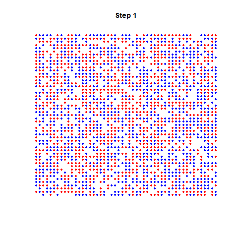

# Analyse spatiale  {#anaspat}


## Contenu du chapitre

Ce chapitre présente quelques notions d'analyse spatiale proprement dite. Ces notions ne sont pas au programme du module d'analyse statistique 


L'analyse spatiale s'intéresse aux **structures** récurrentes de l'espace et à leur **influence** sur les processus que cet espace supporte. 


Cette fois-ci les variables qui nous intéressent ont un rapport avec la localisation, la distance et les interactions d'objets spatialisés.
Les thèmes abordés dans ce court chapitre sont : 


- Analyse de semis de points

- Auto-corrélation spatiale globale 

- Notions sur les flux 

- Principe du modèle gravitaire 


Ces outils, même s'ils sont relativement basiques, sont utiles et puissants, mais ils ne peuvent pas se substituer à une représentation cartographique adéquate d'un phénomène spatialisé, ni sa description exhaustive. 

Les outils statistiques apportent des informations complémentaires, quantifient des phénomènes (par exemple la spatialisation des résidus d'un modèles nous indique quelles sont les zones qui résistent au pouvoir généralisateur du modèle), et sont destinés à être employés en combinaison avec une méthodologie adéquate, des représentations cartographiques et un discours précis qui lie le tout. Calculer l'auto-corrélation spatiale d'une mesure et s'en tenir là n'aurait pas de sens.

>(opinion personelle) Une **bonne** carte surpasse toute analyse statistique spatiale (statique)


### L'information géographique

L'information géographique est une information localisée en une, deux (la plupart du temps), ou trois dimensions. 

Ici , au contraire des chapitres précédents, ce qui nous intéresse principalement, c'est la **localisation** des individus de la populations.
L'immense majorité des objets que nous allons aborder sont des objets qui peuvent être ramenés à des objets ponctuels, où à des graphes dont les nœuds sont des objets ponctuels: 


- Objets : e.g. arbres de Paris,  stations de Vélib'
- Événements : e.g. incendies , accidents 
- Mesures : e.g. altitude, température, pollution 
- Statistiques : e.g. taux de chômage par quartier, votes par communes
- Interactions : mobilité, flux commerciaux
<br><br><br>
<span style="font-size:0.6em;">d'après H.Commenges, Données massives spatialisées </span>

### Précautions dans l'emploi de projections


Nous ne ferons que des calculs en coordonnées projetées. 

Si on a besoin de calculer des **surfaces**  (e.g. densité) , il faut utiliser une **projection équivalente**.

Si la **distance** intervient dans l'analyse, il faut utiliser une **projection conforme**.


Cette mise en garde ne s'applique que pour les calculs. une fois qu'ils sont faits, le choix de la projection pour la cartographie est laissé au cartographe.    


## Semis de points

Les données **ponctuelles** représentent des unités spatiales localisées à un point et/ou dont on peut négliger l'emprise au sol.

On peut étudier la répartition de ces points avec la distance euclidienne dans l'espace qu'on suppose **isotrope** (invariant par direction) et **homogène** (invariable par translation).

```{r arbres, cache=T, fig.width=7, fig.height=4, echo=FALSE }
library(geojsonsf)
library(dplyr)
arbres <- geojson_sf("./data/les-arbres.geojson")

arbres <- st_transform(arbres,2154)
arbres <- st_set_crs(arbres, 2154)
arbres$arrondissement <- as.factor(arbres$arrondissement)
arbres_intramuros <-  filter(arbres, !(arrondissement %in% c("BOIS DE BOULOGNE",  "BOIS DE VINCENNES", "HAUTS-DE-SEINE", "SEINE-SAINT-DENIS", "VAL-DE-MARNE")))
# on retire les valeurs modales inusitées de la variable 
arbres_intramuros$arrondissement <- as.character(arbres_intramuros$arrondissement)
arbres_intramuros$arrondissement <- as.factor(arbres_intramuros$arrondissement)
quartiers <-(read_sf("./data/quartier_paris.shp"))
quartiers <- st_transform(quartiers, 2154)
quartiers <-  st_set_crs(quartiers,2154)
par(mar=c(0,0,0,0))
plot(quartiers$geometry)
plot(arbres_intramuros$geometry, add=TRUE, alpha=0.5, cex=0.01, col="orange"  )
```

Par exemple avec la localisation des arbres de paris, on observe que les arbres ne sont pas localisés n'importe où : la localisation des arbres à Paris n'est pas isotrope. 

En pratique, les données spatiales sont rarement réparties de façon isotropes. On fait pourtant souvent l'approximation de faire des calculs avec la distance euclidienne, qui suppose en principe d'avoir un espace isotrope, pour que les distances aient un sens. 


### Point moyen et point médian 

Si on définit une distance dans l'espace, par exemple ici la distance euclidienne, on peut définir  deux points particuliers à ce semis : 


Le **point moyen** est le point dont les coordonnées sont les moyennes des coordonnées des points du semis (en $x$ et en $y$).

Si on le note $G$ , $x_G=\bar{x}$ et $y_G=\bar{y}$.


Le **point médian** est **le point le plus accessible** du semis, celui qui minimise la somme des distances entre lui et les autres points du semis. Il sépare la population en quatre cadrants contenant chacun 25% de l'effectif.
Avec la distance euclidienne, il ne peut pas se calculer directement , et s'obtient par approximations successives (il est trouvé par la résolution d'un problème d'optimisation)

:::{.note}
Ces deux indicateurs n'ont de sens que dans une référentiel **euclidien**.
Dans un espace rectilinéaire, i.e. où on utilise la **distance de Manhattan**, son calcul est plus direct: 
:::

### Dispersion et concentration d'un semis

La **dispersion** du nuage de points est approchée par la **distance type** (euclidienne) :

$$\sigma_{Dist}= \sqrt{\frac{1}{n}\sum_{i=1}^n(x_i-\bar{x})^2 + (y_i-\bar{y})^2} =  \sqrt{\sigma_x^2 +\sigma_y^2}$$

Ce n'est pas pour rien qu'on l'appelle la distance type , car c'est l'écart type des distances au point moyen.
On reconnaît dans la formule la racine carrée de la somme des variances des coordonnées.


Voici un exemple de deux semis de points, répartis dans les IRIS du département de la Seine-Saint-Denis, avec la valeur de leurs distances types. 


Le nombre de points est identique dans les deux cartes. 
Dans le semis de gauche, dans la surface de chaque IRIS, on tire 2 points aléatoirement.
Dans le semis de droite, on tire aléatoirement le même nombre de points (2 x Nombre d'IRIS), mais dans toute la surface de la Seine-Saint-Denis .

```{r polar1, cache =T, fig.height=4, fig.width=8, echo=FALSE }
set.seed(5678)  
ssd <-  read_sf("data/neufTrois_simple.shp")
par(mar=c(0,0,0,0))
par(mfrow=c(1,2))
pts <-  st_sample(ssd, rep(2, length(ssd$geometry)))
plot(ssd$geometry, lwd=0.8, border="gray")
plot(pts, add=T, pch=20, cex= 0.4, col= "orange" )
pts2 <-  st_sample(ssd, length(ssd$geometry)*2)
plot(ssd$geometry, lwd=0.8, border="gray", reset=T)
plot(pts2, add=T, pch=20, cex= 0.4, col= "orange" )
coordsPT1 <-  as.data.frame(st_coordinates(pts))
coordsPT2 <-  as.data.frame(st_coordinates(pts2))
cat("Distance type à gauche", sqrt(sd(coordsPT1$X)**2 + sd(coordsPT1$Y)**2))
cat("Distance type à droite", sqrt(sd(coordsPT2$X)**2 + sd(coordsPT2$Y)**2))
```


la configuration de gauche est plus agrégée/polarisée , du fait de la différence de surface des IRIS et de leur nombre de points constants.
Celle de droite est plus homogène, même si ce terme n'a pas beaucoup de sens puisqu'on n'évalue pas -encore- la concentration des points. 


<br>


La **concentration** d'un semis est mesurée par l'**indice de concentration**, qui décrit la régularité des positions des points.

Pour l'obtenir : 


- on discrétise l'espace en $C$ mailles de formes régulière( carrée, hexagonale) 
- on calcule le nombre de points théorique par maille (la densité théorique) : $D_{théo}= N/C$
- on compte le nombre de points du semis  par maille (la densité observée) et on calcule la variance de cette série : $$var(D_{obs}) = \frac{1}{C}\sum_c(nb_c-D_{théo})^2$$ 

avec: 

- $nb_c$, le nombre de points comptés dans la maille $c$
- $C$ le nombre de maille du maillage
- $N$ le nombre de points du semis.


L'indice de concentration est le ratio entre la densité et la variance du nombre de points par maille : $$IC= var(D_{obs})/D_{théo}$$

- si IC = 1 , la distribution est **aléatoire** 
- si IC > 1 , la distribution est **concentrée**
- si IC < 1 , la distribution est **homogène** 


Vous avez reconnu la comparaison -ici par un ratio- entre la distribution *observée* d'une quantité -la densité-  et sa distribution *théorique*. De cette comparaison, on peut quantifier l'écart au modèle nul, ici une répartition aléatoire des objets. 

comme dans le test du $\chi^2$ , abordé en section \@ref(chi2).

Voici quelques exemples de semis avec leur indice de concentration associés:


### Le modèle nul pour un semis de points 


Un processus de spatial de Poisson est un processus spatialement
aléatoire.

Dans un espace découpé en zones, on estime la probabilité d'avoir un nombre de points)dans une zone $z$ par une distribution de poisson de moyenne $\lambda * surface(zone)$.


## Auto-corrélation spatiale : Moran et Geary


L'auto-corrélation spatiale est une mesure statistique qui répond à la question suivante: 

<center>
« Les valeurs d'entités spatiales proches sont-elles plus similaires que les valeurs d'entités lointaines ?»

«Est-ce que les grosses(resp. petites) valeurs sont rapprochées (resp.dispersées) ? »</center>

\
E.g. (au hasard) Les personnes pauvres et les personnes riches sont-elles regroupées au même endroit dans une ville ?

Valeurs positives : situations ségrégées

Valeurs nulles : répartition aléatoire

Valeurs négatives : alternance parfaite entre valeurs 


### L'indice de Moran 

L'indice $I$ de Moran utilise un terme $\omega_{ij}$  positif d'"interaction" pour quantifier la **proximité** entre deux entités $i$ et $j$.

On peut le choisir discret (1 si voisins , 0 sinon) ou continu (inverse de la distance).

$I=\frac{n}{\sum_i \sum_j \omega_{ij}} \frac{\sum_i \sum_j \omega_{ij}(X_i-\bar{X})(X_j-\bar{X})}{\sum_i(X_i-\bar{X})^2}$

<span style= "font-size:0.5;"> avec $n$ le nombre d'entités spatiales , 

$\omega$ une matrice carrée de poids positifs de dimension $n$, telle que $\omega_{ij}$ quantifie la proximité, l'influence de $j$ sur $i$ , 

$\bar{X}$ la moyenne de la variable $X$ </span> 

### L'indice de Geary 

Cet indice, noté $C$,  est dit plus "local" que l'indice de Moran 


$C=\frac{(n-1) \sum_i \sum_j \omega_{ij}(X_i-X_j)^2 }{2W\sum_i(X_i-\bar{X})^2}$

$C\in[0;2]$  

$C<1$ : auto-corrélation négative, 

$C=1$ : pas d'autocorrelation, 

$C>1$ :  autocorrélation positive

<span style= "font-size:0.6em;"> avec <br>$n$ le nombre d'entités spatiales,<br> 
$\omega$ une matrice carrée de poids positifs de dimension $n$, de somme $W$ et telle que $\omega_{ij}$ quantifie la proximité, l'influence mutuelle de $j$ sur $i$, $\bar{X}$ la moyenne de la variable $X$ </span> 


### Commandes R

Les mesures des indices de Moran et Geary s'obtiennent avec les fonctions `moran` et `geary` du package `spdep`


### Interprétation de l'indice de Moran


les images suivantes montrent comment varient les valeurs de l'indice de Moran en fonction de la localisation d'une quantité dans une grille régulière.


## Les flux

### Matrice de flux

Pour une partition en zones d'un espace, on appelle **flux** toute mesure d'intéraction spatiale qui implique des échanges, des déplacements entre deux zones, matériels ou immatériels.   

On range les mesures qui mesurent ces échanges dans un **matrice de flux**,une matrice carrée $F$ dont le terme général $F_{ij}$  indique la quantité échangée entre le site $i$ en ligne et le site $j$ en colonne .

### Indices 

$V_i= \sum_i F_{ij} + \sum_j F_{ij}$  : Volume = Départs + Arrivées

$S_i = \sum_i F_{ij} - \sum_j F_{ij}$  : Solde= Départs - Arrivées

$A_i = \frac{S_i}{V_i}$  : Attractivité = ratio des soldes sur les volumes


### Cartographie des flux 


On en peut pas représenter tous les flux entre toutes les zones (lisibilité).

On détermine les flux **dominants** de la façon suivante:

$F_{ij}$ est dominant si:

 - $i$ envoie son flux le plus important vers $j$
 - la somme des arrivées  de $j$ est plus importante que la somme des arrivées de $i$ 


package `flows` de R : https://cran.r-project.org/web/packages/flows/vignettes/flows.html par les auteurs de `cartography`

## Exemple
```{r flow, echo=F, fig.height=5.5, fig.width=6}
# Import data
library(flows)
# installer le package à partir du dépot si ça ne fonctionne pas : 
#devtools::install_github("rCarto/flows")
data(nav)
myflows <- prepflows(mat = nav, i = "i", j = "j", fij = "fij")

# Remove the matrix diagonal
diag(myflows) <- 0

# Select flows that represent at least 20% of the sum of outgoing flows for 
# each urban area.
flowSel1 <- firstflows(mat = myflows/rowSums(myflows)*100, method = "xfirst", 
                       k = 20)


# Select the dominant flows (incoming flows criterion)
flowSel2 <- domflows(mat = myflows, w = colSums(myflows), k = 1)

# Combine selections
flowSel <- myflows * flowSel1 * flowSel2

# Node weights
inflows <- data.frame(id = colnames(myflows), w = colSums(myflows))

# Plot dominant flows map
opar <- par(mar = c(0,0,2,0))
sp::plot(GE, col = "#cceae7", border = "gray")
plotMapDomFlows(mat = flowSel, spdf = UA, spdfid = "ID", w = inflows, wid = "id",
                wvar = "w", wcex = 0.05, add = TRUE,
                legend.flows.pos = "topright",
                legend.flows.title = "Nb. of commuters")
title("Dominant Flows of Commuters in the French Grand Est")
mtext(text = "INSEE, 2011", side = 4, line = -1, adj = 0.01, cex = 0.8)
```

### Pour aller plus loin


les flux sont modélisés par des graphes, une grande partie de la littérature de l'analyse de réseaux et des notions de théories des graphes peuvent être transposées et utilisées pour l'analyse de flux.

E.g. Attributs de noeuds ou d'arcs : 

- centralité de degré (nombres de voisins dans le graphe)
- centralité d'intermédiarité (fréquence d'apparition du noeud dans les plus courts chemins entre deux noeuds du graphe)

Attributs de graphes : 

- communautés (sous graphes denséments connectés)
- densité de liens
- ...


## Le modèle gravitaire 

### Fin XIX<sup>e</sup> : Les lois de Ravenstein
(Ravenstein E., 1885 & 1889, "The Laws of Migration", Journal of Royal Statist. Society, London , d'après Noin D., 1988, Géographie de la Population, Masson, Paris, pp. 273-274, cité par C. Grasland.

<span style= "font-size:0.6em; line-height:normal;">Le nombre de migrants diminue quand la distance augmente; la plupart ne vont pas très loin ; ceux qui se déplacent sur de grandes distances se dirigent de préférence vers les grands centres commerciaux et industriels.<br>
    Le processus se fait de la façon suivante : une ville à croissance rapide attire les gens des régions environnantes ; les vides ainsi créés sont comblés par les migrants de districts plus éloignés ; la force d'attraction des grandes villes dynamiques se fait donc sentir de proche en proche en diminuant d'intensité. Le nombre de migrants de la zone d'accueil est donc **proportionnel à la population de la zone d'origine et inversement proportionnel à la distance qui les sépare**.<br>
    Chaque courant principal de migration suscite un contre-courant compensatoire.<br>
    Les citadins ont une mobilité plus faible que les ruraux<br>
    Les femmes ont une mobilité plus forte que les hommes, au moins à courte distance.<br>
    L'intensité des migrations augmente avec le développement du commerce, de l'industrie et des transports<br>
    Les facteurs déterminant la migration sont nombreux mais le plus important est le facteur économique</span>


### Le modèle gravitaire

Modèle simple, déterministe et symmétrique qui prose de calculer l'intensité de l'interaction entre deux entités spatiales en fonction de leurs **masses** et de la distance qui les sépare.

Plusieurs formulations : 

$Fij = k \frac{P_i . P_j}{D_{ij}^2}$

avec $P_i$ la masse (e.g. population, attraction, emmission, etc.) de l'entité spatiale $i$, $D_ij$ une fonction de **coût** e.g. la distance qui sépare $i$ de $j$

$Fij = k \frac{P_i . P_j}{D_{ij}^\alpha}$

avec alpha le **frein à la distance** (distance decay) , pour modéliser des déplacements plus ou moins faciles 


### Distance et interaction 

<p style= "font-size:0.6em; line-height:normal;"> D'après H.Commenges, cours d'analyse spatiale , Delhi R School</p>

Lorsque l’interaction est spatialisée, elle implique nécessairement une **distance**.

- L’interaction spatiale considère le déplacement comme un effort.
- L’interaction spatiale est le rapport dialogique entre **mise en contact** et **friction de l’éloignement**.
- L’interaction spatiale être abordée de deux façons : relations entre lieux ou attraction/influence d’un lieu sur les autres lieux.
- Dans le premier cas on parlera d’analyse de flux
 - Dans le second cas on parlera d’analyse de position (cf. Accessibilité)


### Utilisation du modèle gravitaire

Exemple d'une formulation plus générale : 
$F_{ij} = \alpha_i \beta_j E_i A_j C_{ij}^{−n}$ 

<p align="left" style="font-size: 70%">
avec $\alpha_i$ et$\beta_j$ des facteurs d'équilibrage qui assurent la contrainte aux marges,<br>
$E_i$ et $A_j$ :  valeurs d’émission et d’attraction de la zone <br>
$C_{ij}$ : coût généralisé du trajet de $i$ vers $j$ : temps, prix , inconfort.<br>
$n$ : frein à la distance, la valeur varie selon les motifs de déplacement. (plus faible vers le travail que vers des motifs "secondaires" (e.g. courses quotidiennes)<br><br>


On détermine les valeurs des coefficients ($\alpha,\ \beta,\ n$)inconnus  par **calibration** sur des données (problème d'optimisation classique, qu'on peut résoudre par algorithme génétique, recuit simulé, etc.)


### Variantes du modèles gravitaires 

- Nature des masses: population, emplois, émission , attraction , offre, demande

- Pondérations des masses : facteurs ou exposants

- Fonction de friction : puissance , exponentielle

- Contraintes aux marges : aucune , simple, double


## L'étape d'après : modèles dynamiques


Les modèles que nous avons jusqu'à présent étaient des modèles statiques: ils décrivaient ou résumaient des données par des objets mathématiques eux aussi "statiques".

Nous avons vu le modèle linéaire , qui résume une nuage de points lorsqu'il a la forme appropriée. Cet objet est fixe, il s'agit des deux coefficient d'une équation de droite $y=ax+b$, et $a$ et $b$ une fois déterminés n'ont pas vocation à évoluer.


### Modèles simples : les automates cellulaires

Le plus célèbre des modèles simples : le jeu de la vie (Conway)


Modèle de ségrégation de Schelling 





### Principe d'un modèle complexe de mobilité

Modèle à 4 étapes 

1.  Module de **génération** : quantité de déplacements attirés et émis par zones prédécoupées (caractéristiques de la population et des activités)
    
2. Module de distribution : répartition géographique des flux (modèle gravitaire)

3. Module de choix modal : par quel modalité s'effectue le transport ? 

4. Module d'affectation au réseau 


Modèles LUTI : Land Use Transport Integration 

**Accessibilité** et **Usage du sol** exercent une influence l'un sur l'autre.


**Simule** les foyers, leurs choix de résidence , d'activité et de transports.


  
  